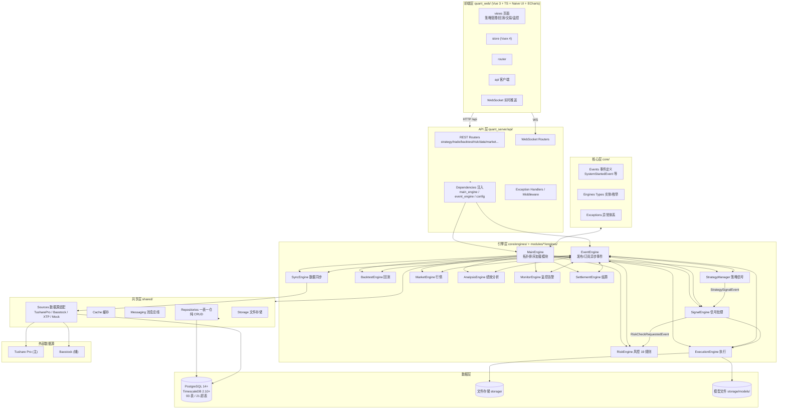
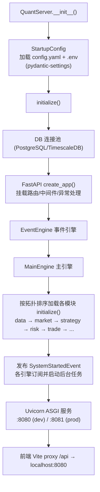
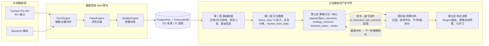
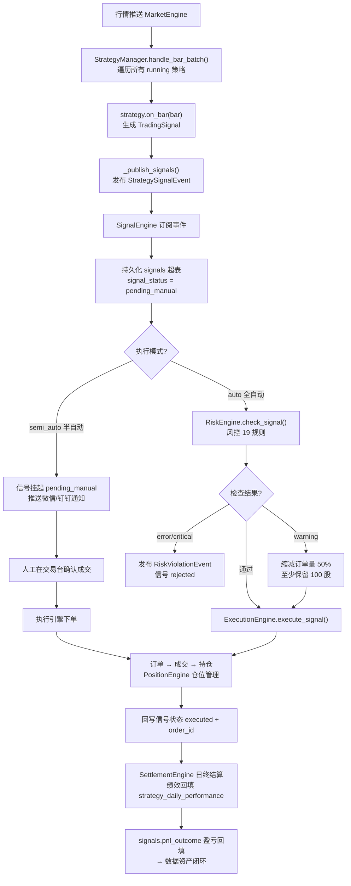
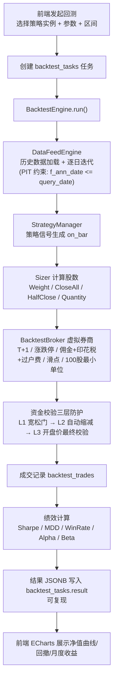
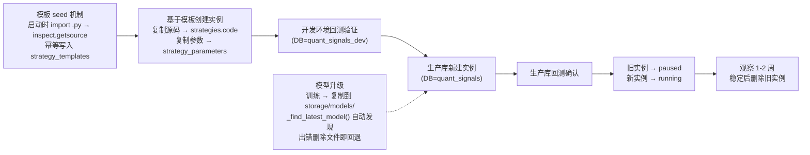
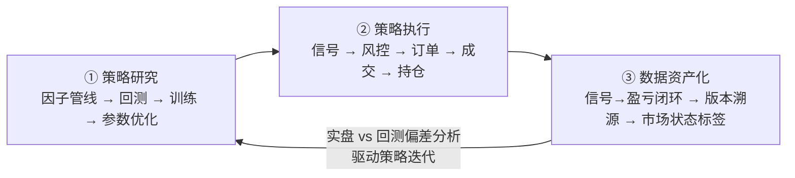

# 量化交易平台 — 架构与业务流程流程图

> 2026-08 | 基于 `docs/01-业务设计/量化交易系统详细设计.md`、`docs/01-业务设计/数据资产架构与系统定位.md` 及代码实际结构（引擎/事件/模块目录）整理
> 用途：系统架构、启动流程、数据流、实盘链路、回测链路、策略生命周期的一站式图解

---

## 一、系统总体架构（分层视图）

**依赖方向（严禁反向）**：`modules/ → shared/ → core/`、`modules/ → utils/`、`api/ → shared/`

**通信机制**：
| 场景 | 方式 |
|:---|:---|
| Service → Repository | 同步直接调用 |
| 模块间（如 strategy → trade） | 仅通过 EventEngine 异步事件 |
| Engine 之间 | EventEngine 发布/订阅 |

---

## 二、系统启动流程

---

## 三、数据流全景图（数据同步管道 → 数据资产化）

**关键数据表**：`stock_daily`/`etf_daily`/`index_daily`（超表）、`trade_calendar`、`factor_data`、`market_state_daily`、`signals`（超表，含 `is_executed`/`pnl_outcome`）、`orders`/`trades`/`positions`、`risk_events`、`strategy_daily_performance`。

**PIT 约束**：财务数据查询必须加 `f_ann_date <= query_date`——回测/因子计算只能用该时点真实可见的财报数据。

---

## 四、实盘交易业务流程（信号 → 风控 → 执行）

**信号类型**：`ENTRY` / `EXIT` / `STOP_LOSS` / `TAKE_PROFIT`
**事件命名**：`{module}.{domain}.{action}.{status}`，如 `trade.order.submitted`
**交易模式**：半自动为主（策略生成信号 → 人工确认 → 执行），全自动可选

---

## 五、回测业务流程

**Broker 撮合规则（模拟 A 股真实环境）**：
- T+1：当日买入，次日开盘方可卖出
- 涨跌停：主板 ±10%，科创 ±20%，ST ±5%；涨停不买、跌停不卖
- 费用：万一佣金（免五）、0.1% 印花税（仅卖出）、0.002% 过户费（双向）
- 滑点：买入 ×(1+0.1%)，卖出 ×(1-0.1%)
- 最小交易单位：100 股（1 手）

---

## 六、策略开发生命周期与热更新

**关键约束**：
- 实盘策略代码 = 创建时的快照（`strategies.code`），不随 .py 文件修改而变化
- 策略实例升级 = 新建实例 + 验证 + 切换
- 模板随重启自动更新，策略实例不自动更新

---

## 七、模块职责总览

| 模块 | 核心引擎 | 职责 |
|:---|:---|:---|
| **data** | SyncEngine / CleanEngine / QualityEngine / ResearchEngine | 数据同步、因子计算、研究服务 |
| **market** | MarketEngine | 实时行情、交易日历 |
| **strategy** | StrategyManager / StrategyRegistry / CapitalAllocator / DataFeedEngine | 策略管理、信号生成 |
| **risk** | RiskEngine | 风控 19 规则（止损、仓位上限） |
| **trade** | SignalEngine / ExecutionEngine / PositionEngine / RiskEngine | 信号→订单执行、仓位管理 |
| **backtest** | BacktestEngine / BacktestBroker / Sizer / OptimizationEngine / ReportEngine | 历史回测、参数优化、绩效分析 |
| **account** | SettlementEngine | 多账户管理、资金流水、日终结算 |
| **analysis** | AnalysisEngine | 绩效归因、Sharpe/MDD 指标 |
| **monitor** | AlertEngine / SystemMonitor / RiskMonitor / BusinessMonitor | 系统监控、钉钉/微信通知 |
| **system** | — | JWT 认证、系统配置 |

---

## 八、核心业务闭环总结

**系统定位**：实盘验证期（v4.0）——2 个实盘策略（ETF 底部 v5 防守型 + 低吸轮动 v3 进攻型），通过 Regime 路由组合，正在积累独有数据资产。

**里程碑**：2026-08 实盘满 1 月偏差分析 → 2026-09 Regime 路由上线 → 2026-12 组合实盘满 1 季度 → 2027-Q2 实盘信号 > 1000 条 → 2027-Q4 策略工厂 v1。

---

## 附录：核心事件一览（代码实证）

| 事件 | 发布方 → 订阅方 | 说明 |
|:---|:---|:---|
| `StrategySignalEvent` | strategy → trade.SignalEngine | 策略信号 |
| `RiskCheckRequestedEvent` | trade.SignalEngine → risk | 请求风控检查（异步通知） |
| `RiskViolationEvent` | trade.SignalEngine → risk | 风控违规 |
| `SystemStartedEvent` | MainEngine → 各引擎 | 系统启动完成 |
| `monitor.trading.signal` | trade → monitor | 实盘信号推送通知 |
