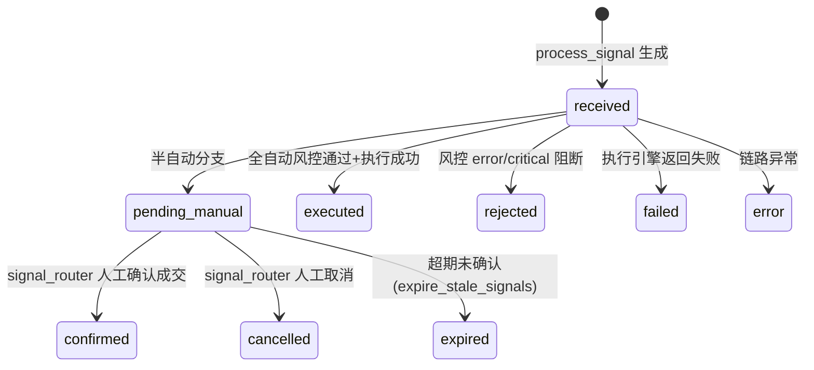
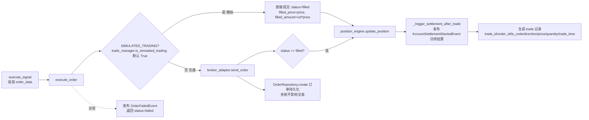

# 信号处理与执行链路设计

> **代码实证基准日期**：2025-06-27（以代码文件内容为准，含 v2.0/v2.4/v3.0/v3.3/v3.4 版本注释）
>
> **对应代码路径**（全部只读实证）：
> - `quant_server/modules/trade/engines/signal_engine.py`
> - `quant_server/modules/trade/engines/execution_engine.py`
> - `quant_server/modules/trade/engines/position_engine.py`
> - `quant_server/modules/trade/engines/risk_engine.py`（兼容包装，委托 `modules/risk/engines/risk_engine.py`）
> - `quant_server/modules/trade/events/`（order/position/execution/risk 四组事件）
> - `quant_server/api/routers/trade_router.py`、`signal_router.py`、`api/main.py`
> - `quant_web/src/views/Signal/SignalConfirm.vue`、`quant_web/src/views/TradeCenter/Workspace.vue`、`TradingDashboard.vue`
> - 辅助：`modules/trade/constants.py`、`modules/strategy/events/signal_events.py`、`shared/database/repositories/strategy/signal/signal_repo_v2.py`

---

## 1. 模块定位与职责边界

trade 模块下三个引擎通过构造函数显式注入依赖，分工如下（均继承 `EngineBase`）：

| 引擎 | 类/文件 | 核心职责 | 关键依赖 |
|:---|:---|:---|:---|
| SignalEngine | `signal_engine.py` | 接收策略信号 → 内存登记 → DB 持久化 → 按执行模式分支（半自动等待人工 / 全自动走风控→执行）→ 状态回写 | ExecutionEngine、RiskEngine、event_engine、session_factory |
| ExecutionEngine | `execution_engine.py` | `execute_signal()` 组装订单 → `execute_order()` 下单（SIMULATED_TRADING 安全开关）→ 成交后更新持仓、触发结算、订单 DB 持久化 | BrokerAdapter（缺省回退 SimBrokerAdapter）、PositionEngine、RiskEngine、trade_manager、session_factory |
| PositionEngine | `position_engine.py` | 持仓/账户同步与查询：`get_position`/`get_account`/`update_position`、总资产/可用资金/持仓市值计算 | BrokerAdapter |

依赖关系（代码实证）：
- `SignalEngine.__init__` 强校验依赖：`_check_dependencies` 中 ExecutionEngine/RiskEngine 为 None 直接抛 `RuntimeError`（signal_engine.py:82-87）。
- `ExecutionEngine.__init__` 中 BrokerAdapter 为 None 时**回退为 SimBrokerAdapter**（初始资金默认 100 万、simulated=True，execution_engine.py:44-50），防止抽象类实例化崩溃；`_check_dependencies` 校验 broker_adapter/position_engine/risk_engine 三者（execution_engine.py:137-144）。
- 风控职责已收敛：trade 模块内 `engines/risk_engine.py` 仅是**兼容包装**，将 `RiskEngine` 从 `modules.risk.engines.risk_engine` 重新导出（trade/engines/risk_engine.py:17），实际实现见《风控规则设计.md》。

---

## 2. 信号链路完整流程

### 2.1 触发入口

SignalEngine 启动时订阅策略信号事件（signal_engine.py:56-61）：

```python
from modules.strategy.events.signal_events import StrategySignalEvent
self.event_engine.subscribe(StrategySignalEvent, self._on_strategy_signal)
```

`_on_strategy_signal` 将 `event.data` 直接交给 `process_signal()`（signal_engine.py:63-65）。

### 2.2 完整链路

```mermaid
flowchart TD
    A[StrategySignalEvent<br/>strategy 模块发布] --> B[SignalEngine._on_strategy_signal]
    B --> C[process_signal<br/>signal_engine.py:171]
    C --> D[生成 signal_id uuid + 内存登记 signals[signal_id]<br/>status=received]
    D --> E[持久化 signals 表<br/>_persist_signal: signal_status=pending_manual]
    E --> F{run_mode == live?}
    F -->|是| G[发布 monitor.trading.signal 通知事件<br/>微信/钉钉渠道]
    F -->|否| H
    G --> H{execution_mode}
    H -->|semi_auto 半自动| I[status=pending_manual<br/>等待人工确认<br/>回写 DB pending_manual]
    H -->|full_auto 全自动| J[发布 RiskCheckRequestedEvent<br/>异步通知 risk 引擎]
    J --> K[同步 check_signal<br/>risk_engine.check_signal]
    K --> L{is_valid?}
    L -->|否| M[发布 RiskViolationEvent<br/>status=rejected<br/>回写 DB rejected]
    L -->|是| N{action_hint == reduce_size?}
    N -->|是| O[订单量缩减 50%<br/>max(quantity*0.5, 100)]
    N -->|否| P
    O --> P[execution_engine.execute_signal]
    P --> Q{execution_result.success?}
    Q -->|是| R[status=executed<br/>回写 DB executed + order_id]
    Q -->|否| S[status=failed<br/>回写 DB failed]
    P -.异常.-> T[status=error<br/>回写 DB error]
```

### 2.3 关键实现细节（代码实证）

- **信号字段补齐**：`process_signal` 重组 signal dict，`max_slippage_pct` 默认 0.02、`order_type` 默认 `limit_range`、`confidence` 默认 1.0（signal_engine.py:181-199）；v3.4 起 `parent_id` 透传，保证候选→信号追溯链路不断裂（signal_engine.py:194）。
- **DB 落库**：`_persist_signal` 通过注入的 `session_factory` 获取会话，`SignalRepository.create` 写入 signals 超表；`signal_type`/`direction` 做兼容映射（entry→buy、exit→sell、stop_loss→sell、take_profit→sell、long→buy、short→sell 等；direction 映射 close_long→sell、close_short→cover），初始 `signal_status` 一律为 `pending_manual`（signal_engine.py:109-169）；`strategy_id` 缺失时跳过持久化。
- **半自动通知**：仅 `run_mode == "live"` 时发布 `event_type="monitor.trading.signal"` 事件（signal_engine.py:208-211、299-331），payload 含 signal_id/strategy_name/ts_code/方向/价格区间/滑点/数量/置信度/原因/时间戳。
- **半自动分支**：`execution_mode == "semi_auto"`（与 `ExecutionMode.SEMI_AUTO` 等价）→ 状态置 `pending_manual`、入 `processed_signals`、回写 DB（signal_engine.py:214-224）。注意：`ExecutionMode` 枚举定义于 `modules/trade/constants.py:8-11`（`semi_auto`/`full_auto`），v2.4 从 strategy 模块独立出来以消除跨模块依赖。

---

## 3. 执行模式与信号状态机

### 3.1 执行模式

| 模式 | 枚举值 | 链路 | 来源 |
|:---|:---|:---|:---|
| 半自动 semi_auto | `ExecutionMode.SEMI_AUTO` | 策略信号 → 人工确认 → 执行 | constants.py:10 |
| 全自动 full_auto | `ExecutionMode.FULL_AUTO` | 策略信号 → 风控 → 直接执行 | constants.py:11 |

`process_signal` 按 `signal_data["execution_mode"]`（默认 `semi_auto`）分支（signal_engine.py:209、214）；`run_mode` 默认 `backtest`（signal_engine.py:208）。

### 3.2 信号状态机

内存态（signal dict 的 `status` 字段）与 DB 态（signals 表 `signal_status` 字段，v3.3 起统一）如下：



| 状态 | 触发点 | DB 回写 | 代码依据 |
|:---|:---|:---|:---|
| received | `process_signal` 内存登记 | 初始落库即 `pending_manual` | signal_engine.py:197、160 |
| pending_manual | 半自动分支 | `_update_signal_status(db_id, "pending_manual")` | signal_engine.py:216-219 |
| executed | 全自动执行成功 | `_update_signal_status(db_id, "executed", order_id)`，同时回写 order_id | signal_engine.py:274-278 |
| rejected | 风控 error/critical 违规 | `_update_signal_status(db_id, "rejected")` | signal_engine.py:256-259 |
| failed | 执行引擎 success=False | `_update_signal_status(db_id, "failed")` | signal_engine.py:279-282 |
| error | 链路异常（异常兜底） | `_update_signal_status(db_id, "error")` | signal_engine.py:284-287 |
| confirmed / cancelled / expired | 人工确认/取消/超期 | signal_router 与 signal_repo_v2 直接 update | signal_router.py:62-67、101-105；signal_repo_v2.py:40-52、55-63 |

**DB 回写逻辑**（signal_engine.py:333-347）：`_update_signal_status` 仅在 `db_id` 与 `session_factory` 均存在时执行；通过 `SignalRepository.update` 写 `signal_status`，带 `order_id` 时一并回写。持久化/回写失败仅记 warning 日志，**不阻断主链路**。

另外两条并行状态通道：
- `trade_router` 的 `PUT /signals/{signal_id}/review`（review_signal，handlers.py:610-648）：仅允许 `pending`/`pending_manual` 状态被审核，写入 `approved`/`rejected`，并记 reviewed_at/reviewed_by。
- `signal_router` 的 confirm/cancel 走 `signal_repo_v2.update_signal_status`，写入 `confirmed`/`cancelled`，confirm 时带成交价/数量/审核时间。

---

## 4. 风控交互

信号级风控采用**异步事件 + 同步调用双通道**（signal_engine.py:226-269）：

1. **异步通知**：全自动分支先 `event_engine.put(RiskCheckRequestedEvent(signal_data=signal))`（signal_engine.py:229-236，event_type=`risk.check.requested`，source=`trade_signal_engine`），由 risk 模块 `RiskEngine` 订阅处理（risk_engine.py:100-104 → `_on_risk_check_requested`，违规时补发 RiskViolationEvent，risk_engine.py:123-134）。发布失败仅 debug 日志，不影响主流程。
2. **同步检查**：随后直接 `await self.risk_engine.check_signal(signal)` 获取 `(is_valid, message)`，并通过 `get_last_check_action_hint()` 取最高 action 建议（signal_engine.py:239-240）。
3. **阻断分支**：`is_valid == False`（error/critical 级违规）→ 发布 `RiskViolationEvent(rule_name="signal_check", ...)`（signal_engine.py:244-255）→ 信号 `rejected`。
4. **warning 缩减**：`action_hint == "reduce_size"` 且 quantity 存在 → `quantity = max(int(quantity * 0.5), 100)`（**缩减 50%，至少保留 100 股**，signal_engine.py:262-269）。
5. `RiskViolationEvent` 的来源为 `modules/risk/events/risk_events.py`（event_type=`risk.signal.violation.detected`，priority=HIGH）。

> 说明：`modules/trade/events/risk_events.py` 中还存在一组**旧版 trade 域风控事件**（`trade.risk.*`，见第 9 节），其 `RiskViolationEvent` 构造签名（violation_type/severity/message）与新版（rule_name/message/signal_data）不同；信号链路实际使用的是新版 risk 模块事件。

---

## 5. 订单与成交

### 5.1 下单流程（execution_engine.py:317-339 → 162-258）



- **安全红线**：`execute_order` 强制检查 `trade_manager.is_simulated_trading()`，未注入 trade_manager 时**默认安全（True）**（execution_engine.py:166-168）；模拟模式不经过券商，直接填 `filled` 并补 `filled_volume/filled_price/filled_amount`（execution_engine.py:170-179）。
- **成交后续**：模拟/实盘成交后均调用 `position_engine.update_position()` 并触发结算事件 `AccountSettlementStartedEvent(settlement_date=今天, settlement_type="daily")`（execution_engine.py:183-185、209-211、260-274）。
- **实盘订单 DB 持久化**：`OrderRepository.create(order)`，失败仅 warning 日志（execution_engine.py:227-238）。
- **启动恢复在途订单**：`_recover_pending_orders` 先按状态 `submitted`/`partial_filled`/`accepted` 从 DB 恢复，再以券商 `get_pending_orders()` 补充去重（execution_engine.py:76-120）。
- **撤销/查状态**：`cancel_order` 调券商并置内存状态 `cancelled`；`get_order_status` 回写内存（execution_engine.py:276-296）。
- **异常路径**：执行异常发布 `OrderFailedEvent(order_id, reason, timestamp)`，返回 `{"status": "failed", "error": ...}`（execution_engine.py:241-258）。

### 5.2 订单状态

代码中存在两套表述（实证）：
- `modules/trade/constants.py:14-20` 与 `events/types.py:12-16`：`pending / filled / cancelled / rejected / failed`。
- `execution_engine` 实际使用：`filled`（模拟成交）、`submitted / partial_filled / accepted`（恢复在途，execution_engine.py:88-90）、`cancelled`（撤单）、`failed`（异常）。
- 订单表（orders）字段实证：order_id/ts_code/direction/price/volume/filled_volume/filled_amount/avg_price/status/submitted_at/filled_at（signal_router.py:222-238 的 trace SQL）。

### 5.3 trade_fees 交易费用

- **常量**：`modules/trade/constants.py:64-68` `TRADING_FEES = {commission_rate: 0.0003, min_commission: 5, stamp_duty: 0.001, transfer_fee: 0.00002}`。
- **落库**：`trade_fees` 表由 `TradeFee` 模型定义（business_models.py:730），Repository 为 `TradeFeeRepository`；费用明细在 `trade_record_service`（手动录入成交链路，handlers.py 的 record_trade）中"创建订单→创建成交→**创建费用（多条 TradeFee）**→更新持仓→更新账户"（trade_record_service.py:6、108、193）；账户模块 `fee_service.py` 提供费用计算与查询（commission/stamp_tax/transfer_fee/regulation_fee，fee_service.py:252-277）。费用类型按 `fee_type` 分组统计。

---

## 6. 仓位管理（position_engine.py）

| 方法 | 行为 | 实证 |
|:---|:---|:---|
| `get_position(symbol=None)` | 从券商拉持仓，按 `symbol or ts_code` 建索引 | position_engine.py:96-101 |
| `get_account()` | 拉账户信息并缓存 | position_engine.py:103-107 |
| `update_position()` | `_update_position` + `_update_account`，记录 last_update_time | position_engine.py:109-117、119-129 |
| `get_position_by_symbol` | 内存查单只持仓 | position_engine.py:131-133 |
| `get_total_asset()` | 账户 `total_asset`（默认 0） | position_engine.py:135-137 |
| `get_available_cash()` | `cash` 优先，回退 `available` | position_engine.py:139-141 |
| `get_position_value()` | Σ quantity×current_price | position_engine.py:143-149 |

- 启动时 `_on_start` 自动同步持仓与账户（position_engine.py:52-56）；成交后由 ExecutionEngine 调用 `update_position()` 刷新。
- 该引擎同时是 risk 模块定时巡检的指标来源（`RiskEngine._collect_risk_metrics` 调用 `get_total_asset/get_position_value/get_available_cash`）。

---

## 7. API 端点（代码实证）

路由注册（api/main.py:156-180）：`trade_router → /quantTrade/trade`、`signal_router → /quantTrade/signals`（自带前缀）。

### 7.1 trade_router（前缀 `/quantTrade/trade`，tags=["交易中心"]）

| 方法 | 路径 | 功能 | 实证行 |
|:---|:---|:---|:---|
| GET | `/orders` | 订单列表 | trade_router.py:91 |
| GET | `/orders/{order_id}` | 订单详情（404 兜底） | trade_router.py:129 |
| POST | `/orders` | 创建订单（需交易权限，201） | trade_router.py:173 |
| POST | `/orders/{order_id}/cancel` | 撤销订单 | trade_router.py:218 |
| GET | `/positions` | 持仓列表 | trade_router.py:267 |
| GET | `/positions/{ts_code}` | 持仓详情 | trade_router.py:305 |
| POST | `/signals/execute` | 执行交易信号 | trade_router.py:351 |
| GET | `/trades` | 交易历史 | trade_router.py:398 |
| GET | `/account` | 账户概览 | trade_router.py:438 |
| POST | `/trades/record` | 手动录入成交（事务内 订单→成交→费用→持仓→账户） | trade_router.py:475 |
| POST | `/trades/record/batch` | 批量录入成交（单笔失败不阻塞） | trade_router.py:514 |
| GET | `/signals` | 信号列表（status 兼容映射 pending→pending_manual） | trade_router.py:554 |
| PUT | `/signals/{signal_id}/review` | 审核信号（approved/rejected） | trade_router.py:586 |
| GET | `/round-trips` | 买卖配对追溯（FIFO，实时计算不落库） | trade_router.py:632 |
| GET | `/statistics` | 交易统计（trade_records 聚合） | trade_router.py:668 |
| GET | `/health` | 模块健康检查 | trade_router.py:723 |

权限辅助：`superadmin/admin` 默认有交易权限，其他角色需 `can_trade=True`（trade_router.py:81-86）。

### 7.2 signal_router（前缀 `/quantTrade/signals`，人工确认链路）

| 方法 | 路径 | 功能 | 实证行 |
|:---|:---|:---|:---|
| POST | `/{signal_id}/confirm` | 人工确认成交：更新信号为 confirmed + 发布 `SignalConfirmedEvent`（strategy.signal.confirmed，供 StrategyManager 同步持仓） | signal_router.py:37-86 |
| POST | `/{signal_id}/cancel` | 人工取消（默认原因"手动取消"） | signal_router.py:89-110 |
| GET | `/pending` | 待确认信号列表（signal_status=pending_manual，limit≤200） | signal_router.py:113-148 |
| GET | `/{signal_id}/trace` | v3.4 信号链路追溯：信号↔父/子信号↔订单↔成交聚合 | signal_router.py:156-265 |

---

## 8. 前端交易台

### 8.1 SignalConfirm.vue（人工确认页）

- 数据源：`strategyAPI.getPendingSignals()` → `GET /quantTrade/signals/pending`（strategy.ts:286-288）；确认/取消走 `confirmSignal`/`cancelSignal`（strategy.ts:293-303）。
- 状态展示映射（SignalConfirm.vue:26-33）：`pending_manual`→待确认(warning)、`confirmed`→已成交(success)、`partial`→部分成交、`cancelled`→已取消、`rejected`→已拒绝、`expired`→已过期。
- 操作流：pending_manual 行提供「确认成交」「放弃」；确认弹窗填写成交价/数量/时间 → POST confirm；已成交行提供「录入成交」跳转工作台订单页预填参数（SignalConfirm.vue:71-90、100-136）。
- v3.4 起支持「追溯」按钮 → `SignalTraceModal`（调 `/quantTrade/signals/{id}/trace`）。

### 8.2 TradeCenter 交易中心

| 页面 | 文件 | 功能 |
|:---|:---|:---|
| 交易驾驶舱 | `TradingDashboard.vue` | 账户概览（总资产/可用资金/持仓市值/当日盈亏）、持仓迷你列表、WS 实时状态 |
| 工作台 | `Workspace.vue` | 五 Tab：信号流（待审核/已采纳/已执行，含审核 approved/rejected 乐观更新）、持仓、订单、篮子、账户（CRUD/入金出金）；右栏持仓详情+关联订单 |
| 篮子 | `Basket/BasketDetail.vue`、`BasketEditor.vue` | 篮子管理（对应 basket_router `/quantTrade/basket`） |
| 执行分析 | `Execution/ExecutionAnalysis.vue` | 执行质量分析 |
| 账户绩效 | `Account/AccountPerformance.vue` | 账户绩效 |

工作台信号审核：`handleReviewSignal` 乐观更新 UI → `tradeAPI.reviewSignal(signalId, action)` → `PUT /quantTrade/trade/signals/{id}/review`（Workspace.vue:159-175）。

---

## 9. 事件清单（modules/trade/events/，代码实证）

### 9.1 order_events.py（订单域）

| 事件类 | event_type | 关键字段 | 实证行 |
|:---|:---|:---|:---|
| OrderEvent（基类） | — | order_id, symbol | order_events.py:10 |
| OrderUpdateEvent | —（继承 BaseEvent） | order_id, status | order_events.py:18 |
| OrderCreatedEvent | `order_created` | order_id/symbol/order_type/side/price/volume/strategy_id/account_id | order_events.py:26-57 |
| OrderFilledEvent | `order_filled` | order_id/symbol/filled_price/filled_volume/commission/tax | order_events.py:60-89 |
| OrderCancelledEvent | `order_cancelled` | order_id/symbol/cancelled_volume/reason | order_events.py:92-114 |

### 9.2 execution_events.py（执行域，全部 @dataclass）

| 事件类 | event_type | 关键字段 |
|:---|:---|:---|
| OrderCreateEvent | `order_create` | order_data, user_id |
| OrderSubmitEvent | `order_submit` | order_id, order_data |
| OrderCancelEvent | `order_cancel` | order_id, reason |
| OrderFillEvent | `order_fill` | order_id, fill_price, fill_quantity, fill_time |
| OrderRejectEvent | `order_reject` | order_id, reason, order_data |
| ExecutionErrorEvent | `execution_error` | error_message, order_data |
| ExecutionSuccessEvent | `execution_success` | order_id, order_data |

### 9.3 position_events.py（持仓域，全部 @dataclass）

| 事件类 | event_type | 关键字段 |
|:---|:---|:---|
| PositionEvent（基类） | `position_event` | symbol |
| PositionUpdateEvent | `position_update` | symbol, position_data |
| PositionChangeEvent | `position_change` | symbol, direction(buy/sell), quantity, price |
| PositionRiskEvent | `position_risk` | symbol, risk_type, risk_level, message |
| AccountUpdateEvent | `account_update` | account_data |
| CapitalChangeEvent | `capital_change` | change_type(deposit/withdraw/trade), amount, balance |
| MarginCallEvent | `margin_call` | required_amount, current_balance, message |
| PositionLimitEvent | `position_limit` | symbol, current_position, max_position, message |

### 9.4 risk_events.py（trade 域旧版风控事件，module="trade"）

| 事件类 | event_type | priority | 关键字段 |
|:---|:---|:---|:---|
| RiskEvent（基类） | 构造传入 | HIGH/MONITOR | risk_type |
| RiskAlertEvent | `trade.risk.alert` | HIGH/MONITOR | risk_type, risk_level, message |
| RiskCheckEvent | `trade.risk.check` | NORMAL/BUSINESS | check_type, result, message |
| RiskViolationEvent | `trade.risk.violation` | CRITICAL/MONITOR | violation_type, severity, message |
| RiskLimitEvent | `trade.risk.limit` | HIGH/MONITOR | limit_type, current_value, limit_value, message |
| RiskActionEvent | `trade.risk.action` | NORMAL/AUDIT | action_type, action_result, message |
| PositionRiskEvent | `trade.risk.position` | HIGH/MONITOR | symbol, risk_type, risk_level, message |
| AccountRiskEvent | `trade.risk.account` | HIGH/MONITOR | risk_type, risk_level, message |

> 注：信号链路实际订阅/发布的是 `modules/risk/events/risk_events.py` 的**新版事件**（`risk.check.requested`、`risk.signal.violation.detected` 等，见《风控规则设计.md》第 5 节）；本表 trade 域事件为兼容保留。

### 9.5 信号/结算相关外部事件

| 事件类 | event_type | 来源 |
|:---|:---|:---|
| StrategySignalEvent | `strategy.signal.*`（signal_events.py:13-16） | strategy 模块，SignalEngine 订阅 |
| SignalConfirmedEvent | `strategy.signal.confirmed`（signal_events.py:150-167） | signal_router 确认后发布 |
| AccountSettlementStartedEvent | —（settlement_type="daily"） | account 模块，成交后由 ExecutionEngine 触发 |
| 信号通知事件 | `monitor.trading.signal`（BaseEvent，signal_engine.py:310） | trade → monitor 通知渠道（微信/钉钉） |

---

## 附：与既有文档的衔接

- 半自动交易模式（人工确认）与 AGENTS.md「市场与交易模式」一致；`SIMULATED_TRADING=true` 安全开关在 ExecutionEngine 强制执行。
- 事件命名遵循 `{module}.{domain}.{action}.{status}` 规范（如 `risk.check.requested`、`strategy.signal.confirmed`）。
- 数据表（signals/orders/trades/trade_fees/positions）结构见 `docs/量化交易平台数据表设计.md` 与 `docs/sql/create_table.sql`。
