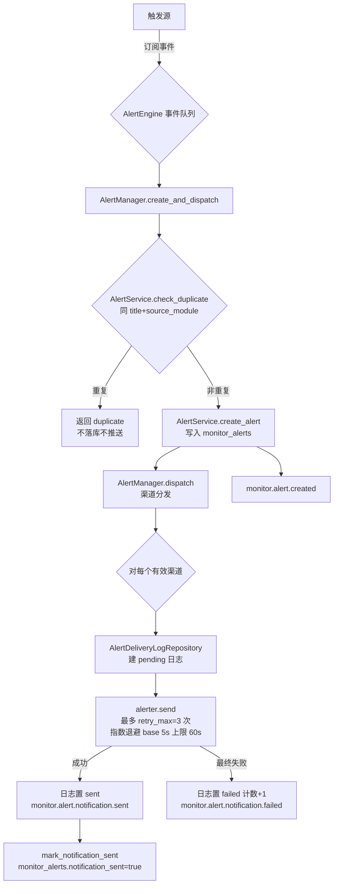

# 监控模块 · 告警与通知设计

> **代码实证基准日期**：2026-08-14
> **对应代码路径**：
> - `quant_server/modules/monitor/`（engines/ events/ alerters/ collectors/ services/ managers/ tasks/ utils/ handlers.py constants.py）
> - `quant_server/api/routers/monitor_router.py`
> - `docs/sql/create_table.sql`（monitor_alerts / monitor_tasks / monitor_thresholds / alert_templates / alert_delivery_logs）
> - `quant_web/src/views/MonitorCenter/AlertCenter.vue`、`quant_web/src/api/risk.ts`
> - `quant_server/config.yaml`（monitor 模块配置，L85-93）
>
> 本文所有配置项与规则均来自上述代码/配置文件实际值；代码中无法确认处标注「待确认」。

---

## 一、模块定位

monitor 模块（config.yaml 中 `enabled: true`，依赖 `data/strategy/trade/account/analysis`）承担三层职责：

1. **系统监控** — `SystemMonitorEngine` 周期采集 OS 资源指标（CPU/内存/磁盘/网络/进程/线程），阈值评估后发布健康事件；
2. **业务监控** — `BusinessMonitorEngine` 周期聚合交易/账户/策略业务指标（订单、持仓市值、PnL）；
3. **告警推送** — `AlertEngine` 统一订阅风险/系统/交易信号事件，经去重、落库、渠道分发（微信/钉钉/邮件）后推送到外部。

v2.0 起风控巡检已迁移至独立 risk 模块：`engines/risk_monitor.py` 与 `events/risk_events.py` 均为**兼容包装**，实际委托/重导出 `modules.risk` 中的 RiskEngine 与风险事件。

---

## 二、监控体系（采集指标）

### 2.1 SystemMonitorEngine（`engines/system_monitor.py`）

- 采集间隔：`system_collect_interval`，默认 `ModuleConfig.SYSTEM_COLLECT_INTERVAL = 10` 秒（constants.py）。
- 采集链路：`SystemCollector.collect()`（psutil，无状态）→ `MetricCollector.record_batch()`（内存缓存最近 100 条）→ `SystemMonitorService.evaluate_metrics()` 阈值评估。
- 指标项（`SystemMetricName`）：cpu_usage / memory_usage / disk_usage / network_in / network_out / process_count / thread_count。
- 默认阈值（`DEFAULT_THRESHOLDS`，constants.py，单位 %）：

| 指标 | warning | critical |
|:---|:---|:---|
| system.cpu_usage | 70.0 | 90.0 |
| system.memory_usage | 80.0 | 95.0 |
| system.disk_usage | 80.0 | 90.0 |
| risk.drawdown / position_ratio / var | 10/80/2 | 20/95/5 |
| performance.avg_latency_ms | 100.0 ms | 500.0 ms |

- 输出：发布 `monitor.system.metrics.collected`；任一指标越限则发布 `monitor.system.health.changed`（`new_status` = warning/critical）。

### 2.2 BusinessMonitorEngine（`engines/business_monitor.py`）

- 聚合间隔：`business_metrics_interval`，默认 `ModuleConfig.BUSINESS_METRICS_INTERVAL = 60` 秒。
- `BusinessMonitorService.aggregate_metrics()` 返回结构：`period` + `trading`（total_orders/filled_orders/cancelled_orders/total_volume/total_turnover）+ `account`（total_assets/available_cash/market_value/daily_pnl/cumulative_pnl）+ `strategy`（active_strategies/total_signals/win_rate/avg_return）。
- 有 DB 会话时通过 `OrderRepository` / `PositionRepository` 填充真实值（`_fill_from_repositories`），失败仅告警日志不阻断。
- 输出：发布 `monitor.business.metrics.updated`。

### 2.3 健康检查（`events/health_events.py`、`managers/health_manager.py`）

- `HealthMonitorEvent.check_passed/check_failed` 发布 `monitor.health.check.passed` / `monitor.health.check.failed`；`all_checks_summary` 按整体状态映射到上述两类事件。
- `SystemMonitorService.get_health_status()` 汇总 event_engine / main_engine / system_resources 三组件的健康状态（事件引擎失败事件 ≥10 视为 degraded）。

---

## 三、告警引擎（AlertEngine）

`engines/alert_engine.py` 继承 EngineBase（engine_type=alert_engine），是告警生命周期的统一入口。

**订阅事件**：`monitor.risk.alert.triggered`、`monitor.system.health.changed`、`monitor.trading.signal`
**发布事件**：`monitor.alert.created`、`monitor.alert.notification.sent` / `monitor.alert.notification.failed`

处理链路（`_process_loop` → `_process_alert` → `AlertManager.create_and_dispatch`）：



关键实证（`managers/alert_manager.py`）：

- **去重**：`AlertService.check_duplicate(session, alert_type, source_module, title)`，`within_hours=0` 表示不限制时间窗（v2.3 注释），重复则整体跳过（`{"status": "duplicate", "alert_id": None}`）。
- **渠道兜底**：`dispatch()` 中 `channels = channels or ["email"]`；但**邮件渠道实际未注册**（见第四章），未注册渠道在分发时标记 `skipped`。
- **重试**：`_retry_max = 3`，`AlertUtils.get_retry_delay(attempt) = min(5 * 2^attempt, 60)` 秒。
- **级别**：`AlertLevel` = info / warning / critical；**状态**：`AlertStatus` = active / acknowledged / resolved / suppressed；**类型**：`AlertType` = system_error / risk_trigger / data_quality / performance / business / trading_signal（v2.0 实盘信号通知）。
- **交易信号**（`_handle_trading_signal`）：默认 `channels=["wechat"]`、级别 info，标题 `[info] 交易信号 - {策略} | {代码} {方向} @ {价格}`，消息含价格区间/最大滑点/建议数量/置信度/确认链接 `/signals/{signal_id}`。
- 外部手动触发：`trigger_alert()`（由 handlers 调用）。

**告警规则落库位置（重要实证）**：handlers 的 `create/update/delete_alert_rule` 实际操作 **monitor_thresholds 表**（`MonitorThresholdRepository`，创建时 `critical_threshold = threshold * 1.5`）。任务说明中提到的 `alert_rules`、`monitor_metrics` 表在 `docs/sql/create_table.sql` 中**不存在**，实际表为 monitor_alerts / monitor_thresholds / alert_templates / alert_delivery_logs / monitor_tasks（见第六节表结构），「alert_rules 表是否曾存在」待确认。

---

## 四、通知渠道（alerters）

`_register_alerters()`（alert_engine.py L87-128）按 **config.yaml 开关 + .env 敏感 URL** 双条件注册：

| 渠道 | config.yaml 开关 | .env 凭证 | 实现要点（代码实证） |
|:---|:---|:---|:---|
| 微信 WechatAlerter | `wechat_enabled: true` | `WECHAT_WEBHOOK_URL` | 企业微信 Webhook，`msgtype=text`，内容截断 2048 字符，超时 10s；`enabled = bool(webhook_url)`；未配应用消息通道（corp_id/agent_id 分支仅告警） |
| 钉钉 DingtalkAlerter | `dingtalk_enabled: false` | `DINGTALK_WEBHOOK_URL`、`DINGTALK_SECRET` | 机器人 Webhook，`msgtype=markdown`，有 secret 时 HMAC-SHA256 签名（timestamp\nsecret → base64 → quote_plus），超时 10s，校验 `errcode==0` |
| 邮件 EmailAlerter | `email_enabled: false` | 待确认（SMTP 配置项 smtp_host/smtp_port/username/password/default_recipients/use_tls） | **类已实现但 AlertEngine 未注册**（`_register_alerters` 中无 email 分支）；`enabled = bool(smtp_host and username)`，TLS(starttls)/SSL 两模式，线程池发送 |

config.yaml 实际值（L85-93）：

```yaml
monitor:
  enabled: true
  auto_start: true
  dependencies: ["data", "strategy", "trade", "account", "analysis"]
  config:
    email_enabled: false
    dingtalk_enabled: false
    wechat_enabled: true   # 唯一开启的渠道
    alert_interval: 300
```

注意事项（实证）：`wechat_enabled=true` 但 `.env` 中 `WECHAT_WEBHOOK_URL` 为空时跳过注册并告警日志（L111）；`alert_interval: 300` 在 AlertEngine 代码中**未发现消费点**（去重窗口为 0，见第三章），用途待确认。另 `NotificationChannel` 枚举含 SMS，但无 SMS alerter 实现。

---

## 五、事件清单（monitor/events）

命名遵循 `{module}.{domain}.{action}.{status}`。全量事件与 event_type：

| 事件类 | event_type | 来源文件 | 触发点 |
|:---|:---|:---|:---|
| AlertMonitorEvent.alert_created | `monitor.alert.created` | events/alert_events.py | AlertEngine 落库后 |
| AlertMonitorEvent.notification_sent | `monitor.alert.notification.sent` | 同上 | 单渠道发送成功 |
| AlertMonitorEvent.notification_failed | `monitor.alert.notification.failed` | 同上 | 单渠道发送失败 |
| AlertMonitorEvent.acknowledged | `monitor.alert.acknowledged` | 同上 | 确认告警（API 链路待确认） |
| AlertMonitorEvent.resolved | `monitor.alert.resolved` | 同上 | 解决告警（同上） |
| SystemMonitorEvent.metrics_collected | `monitor.system.metrics.collected` | events/system_events.py | 系统指标采集 |
| SystemMonitorEvent.health_changed | `monitor.system.health.changed` | 同上 | 阈值越限 |
| SystemMonitorEvent.component_down | `monitor.system.component.down` | 同上 | 组件宕机（触发点待确认） |
| HealthMonitorEvent.check_passed | `monitor.health.check.passed` | events/health_events.py | 健康检查通过 |
| HealthMonitorEvent.check_failed | `monitor.health.check.failed` | 同上 | 健康检查失败 |
| （Business 事件） | `monitor.business.metrics.updated` / `monitor.business.anomaly.detected` | constants EventType 声明 | 业务指标聚合（anomaly 触发点待确认） |
| （Risk 事件，兼容导出） | `monitor.risk.alert.triggered` / `monitor.risk.threshold.breached` / `monitor.risk.metrics.updated` | events/risk_events.py → modules.risk | RiskEngine（v2.0 统一） |

补充：事件优先级（priority 字段）——alert_created 对 critical 为 `critical` 其余 `high`；notification_failed / system.health.changed / component_down 为 `high`；notification_sent / acknowledged / resolved 为 `normal`。

---

## 六、API 端点（monitor_router，前缀 `/quantTrade/monitor`）

| 方法 | 路径 | 说明 | 权限 |
|:---|:---|:---|:---|
| GET | /system/metrics | 系统监控指标 | 登录 |
| GET | /health | 系统健康状态（main_engine） | 登录 |
| GET | /business/metrics | 业务监控指标 | 登录 |
| GET | /performance/stats | 性能统计（event_engine） | 登录 |
| GET | /alerts/history | 告警历史（hours=168, limit=100） | 登录 |
| POST | /alerts/rules | 创建告警规则（阈值） | `can_manage_alerts` |
| PUT | /alerts/rules/{rule_id} | 更新规则，404 兜底 | `can_manage_alerts` |
| DELETE | /alerts/rules/{rule_id} | 删除规则（is_active=false） | `can_manage_alerts` |
| POST | /alerts/manual | 手动触发告警 | `can_trigger_alerts` |
| GET | /dashboard | 监控仪表板（复用 get_health_status） | 登录 |
| GET | /health/module | 监控模块自身健康检查 | 登录 |
| GET | /risk/alerts | **301 重定向** → `/quantTrade/risk/alerts`（v2.0 迁移） | — |

相关表结构（docs/sql/create_table.sql）：

- **monitor_alerts**（L1676）：alert_type / alert_level CHECK(critical,warning,info) / source_module / title / message / metainfo JSONB / status CHECK(active,acknowledged,resolved,suppressed) / acknowledged_by/at、resolved_by/at 引用 sys_users / notification_sent / notification_channels JSONB 默认 `["email","wechat"]`。
- **monitor_thresholds**（L1744）：metric_type / metric_name / warning_threshold / critical_threshold / min_value / max_value / unit / is_active —— **告警规则的实体表**。
- **alert_templates**（L1772）：alert_type+alert_level 维度 title_template / message_template / notification_channels；`AlertService.render_template` 渲染失败回退内置 `ALERT_TEMPLATES`。
- **alert_delivery_logs**（L1796）：alert_id FK CASCADE / channel / recipient / status CHECK(pending,sent,failed,delivered) / error_message / retry_count。
- **monitor_tasks**（L1714）：task_type(system/strategy/data/trade) / schedule_config / check_config / alert_config。

定时任务（tasks/alerting_tasks.py，调度接入待确认）：`scheduled_alert_cleanup`（retention_days=90 清理 resolved 过期告警）、`scheduled_alert_retry`、`scheduled_alert_summary`。

---

## 七、前端告警中心（AlertCenter.vue）

- 路由 `/monitor/alerts`，Naive UI 数据表格 + 严重级别统计条（critical 红 / warning 黄 / info 蓝），列：时间 / 级别 / 来源 / 标题 / 状态（已确认/处理中）/ 操作（确认按钮）。
- **数据源实证差异**：文件头注释声明数据源为 `GET /quantTrade/monitor/alerts` + `PATCH /quantTrade/monitor/alerts/{id}`，但实际代码调用 `riskAPI.getRiskAlerts()` → `GET /quantTrade/risk/alerts`、`riskAPI.acknowledgeRiskAlert()` → `POST /quantTrade/risk/alerts/{id}/acknowledge`（quant_web/src/api/risk.ts L194-203）。即**当前前端告警中心消费的是 risk 模块的告警**，与 monitor 模块 `monitor_alerts` 表及 `/quantTrade/monitor/alerts/*` 端点（monitor_router 中不存在 GET /alerts 列表端点）不一致，属待确认的遗留差异。

---

## 八、关键结论与待确认项

1. 告警主链路（去重→落库→渠道分发→事件广播）实现完整，微信为当前唯一启用渠道；**邮件渠道类已实现但引擎未注册**。
2. `alert_interval: 300` 与 `AlertService.check_duplicate(within_hours=0)` 的语义关系、`monitor.business.anomaly.detected` 与 `monitor.alert.acknowledged/resolved` 的触发点、alerters 的 SMTP 配置来源（config.yaml vs .env）均为**待确认**。
3. 前端告警中心与 monitor 后端告警接口存在路由错位（见第七章），需在后续联调中确认归属。
