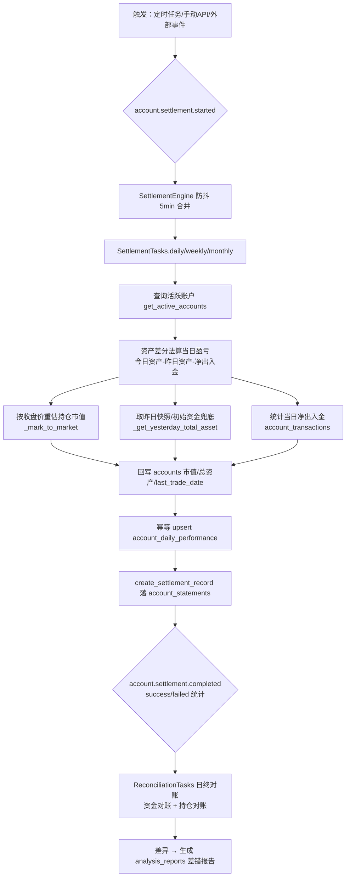

# 结算与资金流水设计（账户模块）

> **代码实证基准日期**：2026-08-13（以 `quant_server/modules/account/` 源码文件 LastWriteTime 最新值为准）
>
> **代码来源（全部只读）**：
> - 引擎：`quant_server/modules/account/engines/settlement_engine.py`
> - 任务：`quant_server/modules/account/tasks/settlement_tasks.py`、`reconciliation_tasks.py`
> - 事件：`quant_server/modules/account/events/`（settlement_events / balance_events / position_events / reconciliation_events / types）
> - 服务与计算器：`modules/account/services/`（account/asset/cash/fee/position_service）、`modules/account/calculators/`（asset/pnl/exposure_calculator）
> - 管理器：`modules/account/managers/`（account_manager / reconciliation_manager）
> - 路由：`quant_server/api/routers/account_router.py` + `modules/account/handlers.py`
> - 表：`shared/database/models/business_models.py`（Account/AccountDailyPerformance/CashFlow/AccountTransaction/Order/Trade/Position）、`docs/sql/create_table.sql`
> - 前端：`quant_web/src/views/TradeCenter/Account/AccountPerformance.vue`
>
> 本文所有指标与规则均来自上述代码实际实现，无法确认处标注"待确认"。

---

## 一、模块定位与职责

账户模块（account）负责**多账户管理、资金流水、日终/周/月结算、对账**四条主线，目录分层遵循 `modules/ → shared/ → core/` 约束：

| 层 | 组件（文件） | 职责 |
|:---|:---|:---|
| Engine | `SettlementEngine`（settlement_engine.py） | 有状态，订阅 `account.settlement.started`，编排日终/周/月结算，发布 `account.settlement.completed` |
| Tasks | `SettlementTasks` / `ReconciliationTasks` | 结算与对账任务的具体执行体（工厂 `create_settlement_tasks()`） |
| Managers | `AccountManager` / `ReconciliationManager` | 跨服务编排（创建账户完整流程、资金/持仓/交易对账、差异修复） |
| Services | `AccountService` / `CashService` / `AssetService` / `FeeService` / `PositionService` | 无状态业务逻辑（CRUD、资金存取冻解转、资产查询） |
| Calculators | `AssetCalculator` / `PnLCalculator` / `ExposureCalculator` | 纯计算：总资产/市值/资产历史、盈亏（FIFO 已实现盈亏）、风险敞口 |

模块内事件驱动：Engine 订阅/发布事件（见第五节），服务层通过 Repository 同步访问数据库，跨模块（如对账差异报告落库到 analysis_reports）直接操作共享表。

---

## 二、结算流程（SettlementEngine 完整链路）

### 2.1 事件入口与防抖

`SettlementEngine._on_initialize` 注册 `AccountSettlementStartedEvent` 处理器（settlement_engine.py:64-70）。`_handle_settlement_started` 处理规则（settlement_engine.py:104-142）：

- `account_ids` 为空（全局结算）→ 直接入队，**不走防抖**；
- 指定账户 → 按 `DEBOUNCE_SECONDS = 300`（5 分钟）防抖：同一账户 5 分钟内重复请求合并，全部被合并时延时 5 分钟后统一执行（`_delayed_settlement`）。

`_process_events` 后台循环消费队列（60s 超时），按 `settlement_type` 分发到 `daily/weekly/monthly_settlement_task`（settlement_engine.py:87-102、164-169），成功后 `session.commit()` 并发布 `AccountSettlementCompletedEvent`（含 total/successful/failed 统计）。

### 2.2 日终结算任务（`SettlementTasks.daily_settlement_task`，settlement_tasks.py:71-166）

1. `account_repo.get_active_accounts(limit=100000)` 取全部活跃账户；
2. **计算当日盈亏**（`_calculate_daily_pnl`，资产差分法，settlement_tasks.py:326-381）：
   ```
   当日盈亏 = 今日总资产 - 昨日总资产 - 当日净出入金
   今日总资产 = 可用资金 + 冻结资金 + 持仓市值(按 trading_day 收盘价重估)
   ```
   持仓市值重估 `_mark_to_market`：按 ts_code IN 批量取当日收盘价（`StockDailyRepository.get_batch_by_date_range`），当日行情缺失时用 `position.last_price` 兜底；
   昨日总资产 `_get_yesterday_total_asset`：取 `account_daily_performance` 中 `< trading_day` 的最近一条 `total_asset`，无历史快照用 `initial_balance` 兜底；
   净出入金 `_get_net_deposit`：统计 `account_transactions` 当日 `deposit - withdrawal`（自建整天时间范围，规避 repo 的 end_date 零点截断问题）；
3. **回写账户资产 + 写日绩效**（`_update_account_assets`，settlement_tasks.py:487-533）：
   - 回写 `accounts`：`market_value`、`total_balance`、`last_trade_date`；
   - 单条幂等 upsert `account_daily_performance`（`_upsert_daily_performance`，(account_id, trade_date) 存在则更新）；
4. **落结算记录**：`account_repo.create_settlement_record` 写入 `account_statements`（对账单仅落库，不再生成 PDF 文件，`statement_path=''`）；
5. 发布 `AccountSettlementCompletedEvent`，单账户失败不中断整体（记入 results 的 failed）。

代码注释明确修复点：B1 原实现混档已实现/未实现盈亏、B2 原 total_asset 为 None 导致 pnl_rate 恒 0、B3 原双写导致每日两条重复绩效、B4 原结算不回写账户表（settlement_tasks.py:334-338）。

### 2.3 周/月结算（settlement_tasks.py:168-324）

- 周结默认周结束日 = 上周五（`today - timedelta(days=today.weekday()-4)`），周初 = 结束日-4 天；
- 月结默认月末 = 上个月最后一天；
- 期间盈亏 `_calculate_period_pnl` 委托 `PnLCalculator.calculate_pnl_analysis`，产出 `total_pnl / win_rate / avg_pnl_per_trade / profit_ratio / max_winning_trade / max_losing_trade / sharpe_ratio / sortino_ratio`；
- 周/月报告由 `StatementGenerator` 生成（`_generate_weekly_report/_generate_monthly_report`），同样落 `account_statements`；
- 可选 Celery `shared_task` 注册（settlement_tasks.py:754-806），未安装 celery 时跳过。

### 2.4 结算链路 mermaid



> 说明：结算（settlement）与对账（reconciliation）在代码中是两个独立任务（`settlement_tasks.py` / `reconciliation_tasks.py`），引擎层仅编排结算；对账由 `ReconciliationManager` 手动/定时触发。

---

## 三、资金流水

### 3.1 表结构（`CashFlow`，business_models.py:514-539）

表名 `cash_flows`，字段：`id / user_id / flow_type / flow_date / amount / currency(默认 CNY) / status(pending/completed/failed) / description / reference_id / reference_type / created_at`。

### 3.2 流水类型（`CashService` 实际写入值，cash_service.py）

| flow_type | 触发方法 | 金额方向 |
|:---|:---|:---|
| `deposit` | `CashService.deposit` | 总余额/可用 +amount |
| `withdrawal` | `CashService.withdraw` | 总余额/可用 -amount（校验可用资金充足） |
| `freeze` | `CashService.freeze_funds` | 可用 -amount，冻结 +amount |
| `unfreeze` | `CashService.unfreeze_funds` | 可用 +amount，冻结 -amount |
| `transfer_out` / `transfer_in` | `CashService.transfer_funds`（单事务双账户） | 转出账户 -，转入账户 + |

> 表注释声明 flow_type 枚举为 `deposit/withdrawal/transfer/dividend/fee`，但代码实际写入 `freeze/unfreeze/transfer_in/transfer_out`，与注释不完全一致（待确认是否历史遗留）。

### 3.3 余额计算规则

- **存取**：`deposit` 校验 `amount >= 0.01` 后 `total_balance/available_balance` 同步加减；`withdraw` 校验可用资金后同步减（cash_service.py:68-244）；
- **转账**：`async with self.db.begin()` 单事务内更新两账户并写两条流水，任一步失败回滚（cash_service.py:484-521）；
- **查询**：`get_cash_flows` 按 `user_id=account_id`（注意：按用户维度查询）、flow_type/日期过滤、倒序分页，结果缓存 5 分钟；`get_balance_summary` 汇总今日 deposit/withdrawal/transfer_in/transfer_out 及 `net_change`（cash_service.py:564-699）。

### 3.4 另一条资金记录链路（供结算统计）

`AccountService.deposit/withdraw`（account_service.py:653-731）走 `adjust_available_balance` 更新余额，并调用 `transaction_repo.add_ledger_entry` 写 `account_transactions`（含 `balance_before`），**日终结算的净出入金统计正基于此表**。即系统存在 `cash_flows`（CashService 使用）与 `account_transactions`（AccountService 使用）两套资金流水，二者覆盖场景不同（待确认是否有意为之）。

---

## 四、账户日绩效（account_daily_performance 超表）

### 4.1 表结构与超表化

- ORM 定义：`AccountDailyPerformance`（business_models.py:433-456）：`account_id / user_id / trade_date(DateTime) / total_asset / cash / market_value / daily_pnl / daily_return / created_at`，联合索引 `(account_id, trade_date)`、`(user_id, trade_date)`；
- **TimescaleDB 超表**：`docs/sql/create_table.sql:3589-3594` `create_hypertable('account_daily_performance','trade_date', chunk_time_interval=>'180 days')`；
- 注：ORM 模型未声明 TimescaleDB 扩展（以 DDL 为准）。

### 4.2 写入路径（结算回填）

- 唯一写入来源：`SettlementTasks._upsert_daily_performance`（settlement_tasks.py:535-573），按 `(account_id, trade_date)` 幂等 upsert；
- `AccountService.record_daily_settlement`（account_service.py:603-651）为旧路径（直接 create，可能造成 B3 双写问题，已被 upsert 取代，代码保留待确认）。

### 4.3 读取路径（资产曲线/增长率）

`AssetCalculator.calculate_asset_history`（asset_calculator.py:227-319）以 **user_id 维度** 查询该表重建资产历史（`trade_date/total_asset/cash/market_value/daily_pnl/daily_return`），无数据时降级从 trades 表重建；`calculate_asset_growth_rate` 取区间首尾 `total_asset` 计算 `total_return / annualized_return / cagr`（asset_calculator.py:321-401）。账户列表接口另附各账户最近一次日终结算的 `daily_pnl/daily_return`（handlers.py:294-314，DISTINCT ON account_id）。

---

## 五、事件清单（account/events）

### 5.1 事件类型枚举（`AccountEventType`，types.py:8-72）

| 枚举 | event_type 值 | 归属 |
|:---|:---|:---|
| BALANCE_UPDATED | `account.balance.updated` | 资金 |
| DEPOSIT_COMPLETED | `account.deposit.completed` | 资金 |
| WITHDRAW_COMPLETED | `account.withdraw.completed` | 资金 |
| ASSET_UPDATED | `account.asset.updated` | 资金 |
| STATUS_CHANGED | `account.status.changed` | 资金 |
| POSITION_UPDATED | `account.position.updated` | 持仓 |
| POSITION_OPENED | `account.position.opened` | 持仓 |
| POSITION_CLOSED | `account.position.closed` | 持仓 |
| POSITION_ADJUSTED | `account.position.adjusted` | 持仓 |
| SETTLEMENT_STARTED | `account.settlement.started` | 结算 |
| SETTLEMENT_COMPLETED | `account.settlement.completed` | 结算 |
| RECONCILIATION_STARTED | `account.reconciliation.started` | 结算 |
| RECONCILIATION_COMPLETED | `account.reconciliation.completed` | 结算 |

### 5.2 事件类（按文件）

- **balance_events.py**：`AccountBalanceUpdatedEvent`（含变动方向/百分比/快照）、`AccountDepositCompletedEvent`（含手续费/实际到账）、`AccountWithdrawCompletedEvent`（含风险等级评估）、`AccountAssetUpdatedEvent`（净资产/资产健康度/风险敞口）、`AccountStatusChangedEvent`（升级/降级判断）；
- **position_events.py**：`AccountPositionUpdatedEvent`（未实现盈亏/持仓状态/风险指标）、`AccountPositionOpenedEvent`（默认保证金=开仓价值 10%）、`AccountPositionClosedEvent`（已实现盈亏=平仓值-成本-费用）、`AccountPositionAdjustedEvent`（大额调整需审批）；
- **settlement_events.py**：`AccountSettlementStartedEvent`（步骤/检查点/耗时估算）、`AccountSettlementCompletedEvent`（成功率/质量等级/改进建议）、`AccountReconciliationStartedEvent` / `AccountReconciliationCompletedEvent`（匹配规则/容差/差异分析）；
- **reconciliation_events.py**：`ReconciliationEvent`。

> **代码不一致（待确认）**：`position_events.py` 的 Opened/Closed/Adjusted 与 settlement_events 中的两个 Reconciliation 事件使用硬编码 `"events.position.opened"` 等 event_type，与 `AccountEventType` 枚举值（`account.position.opened` 等）不一致；结算引擎实际订阅/发布走 `AccountEventType` 枚举。

---

## 六、API 端点（account_router.py 实际路由）

| 方法 | 路径 | 说明 | 响应模型 |
|:---|:---|:---|:---|
| GET | `/quantTrade/account/list`（及 `/quantTrade/account`） | 账户列表（附最近日绩效） | AccountListResponse |
| GET | `/quantTrade/account/users/{user_id}` | 用户账户列表 | AccountListResponse |
| GET | `/quantTrade/account/{account_id}` | 账户详情 | AccountDetailResponse |
| POST | `/quantTrade/account` | 创建账户（201） | 字典 |
| PUT | `/quantTrade/account/{account_id}` | 更新账户 | AccountResponse |
| DELETE | `/quantTrade/account/{account_id}` | 软删除账户（204） | — |
| GET | `/quantTrade/account/{account_id}/balance` | 资金余额 | AccountBalanceResponse |
| POST | `/quantTrade/account/{account_id}/deposit` | 存款 | AccountBalanceResponse |
| POST | `/quantTrade/account/{account_id}/withdraw` | 取款（余额不足 400） | AccountBalanceResponse |
| GET | `/quantTrade/account/{account_id}/positions` | 持仓列表（手动分页） | PositionListResponse |
| GET | `/quantTrade/account/{account_id}/positions/{ts_code}` | 持仓详情 | PositionDetailResponse |
| GET | `/quantTrade/account/{account_id}/summary` | 账户概览（持仓数/市值/盈亏汇总） | AccountSummaryResponse |
| GET | `/quantTrade/account/health` | 模块健康检查 | JSON |
| POST | `/quantTrade/account/settlement/daily` | **手动触发日终结算**（全量活跃账户，直接调 `daily_settlement_task`） | JSON |

> 前缀 `/quantTrade/account` 来自前端调用（AccountPerformance.vue:378 `request.get("/quantTrade/account/list")`）与 FastAPI 路由挂载拼接，实际以应用装配为准（待确认）。

---

## 七、前端页面

**`quant_web/src/views/TradeCenter/Account/AccountPerformance.vue`（账户绩效页）**

- 顶部：账户下拉选择、刷新、返回绩效中心；
- 周期选择：近1周/近1月/近3月/近1年/全部 + 日期范围；
- 摘要栏：总资产、可用资金、当日盈亏、当日收益率（取账户列表最近日绩效）；
- 3×3 指标卡：累计收益、年化收益、夏普比率、最大回撤、Sortino、Calmar、年化波动率、胜率、利润因子；
- 图表：净值曲线&回撤双轴图、月度收益热力图、持仓分布饼图；
- 明细：持仓明细表（代码/名称/数量/成本价/当前价/市值/盈亏/权重）+ 绩效摘要 Tab（最新净值/数据起止/数据点数/总交易次数）。

> 数据来源：`performanceAPI.getAccountPerformance(accountId, {start_date, end_date})` → 实际由分析模块 `/performance/account/{account_id}` 提供（见《绩效分析与归因设计》），前端账户页为分析能力的展示入口。
