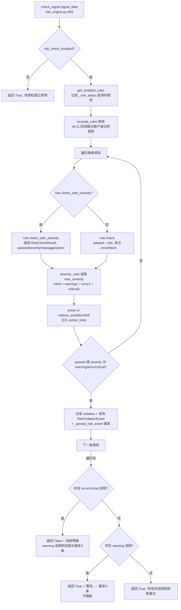
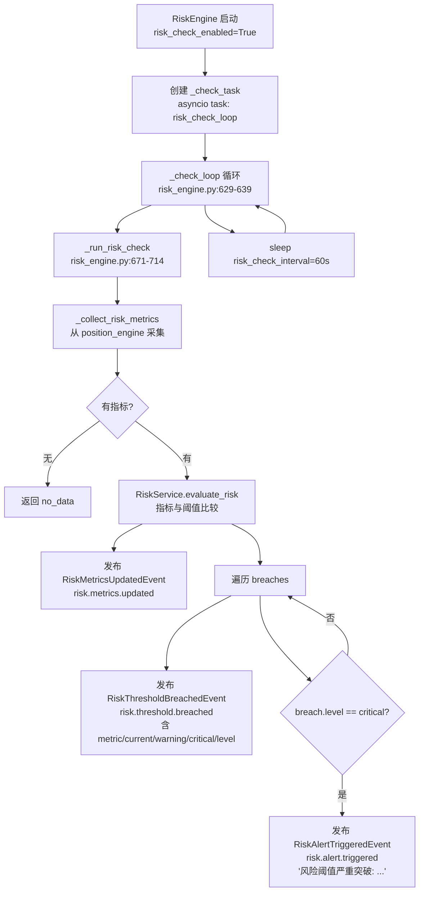

# 风控规则设计

> **代码实证基准日期**：2025-06-27（以代码文件内容为准，含 v2.0/v3.0/v6.11 版本注释）
>
> **对应代码路径**（全部只读实证）：
> - `quant_server/modules/risk/engines/risk_engine.py`（RiskEngine.check_signal 与定时巡检）
> - `quant_server/modules/risk/rules/`（base_rule.py + position_rules.py + account_rules.py + blacklist_rules.py + market_rules.py，共 19 条规则）
> - `quant_server/modules/risk/events/risk_events.py`（6 个统一事件）
> - `quant_server/modules/risk/services/risk_service.py`（定时巡检阈值比较）
> - `quant_server/modules/risk/constants.py`（规则名/默认阈值/模块配置）
> - `quant_server/api/routers/risk_router.py`（端点前缀 `/quantTrade/risk`）
> - `quant_web/src/views/Risk/RiskRules.vue`（规则配置页）
> - 辅助：`modules/risk/handlers.py`、`modules/risk/tasks/daily_check.py`

---

## 1. 风控模块定位（双层风控）

统一 RiskEngine（`modules/risk/engines/risk_engine.py`）同时承担两层职责：

| 层 | 触发方式 | 入口 | 说明 |
|:---|:---|:---|:---|
| **信号级检查** | 实时，由 trade 模块 SignalEngine 调用 | `check_signal(signal_data)` | 遍历启用的 RiskRule 实例逐条检查；v3.0 引入分层 severity（info/warning 不阻断，error/critical 阻断） |
| **周期级巡检** | 定时，引擎内 check loop | `_check_loop()` → `_run_risk_check()` | 采集风险指标与阈值比较，发布阈值突破/告警事件 |

架构要点（代码实证）：
- **规则统一走 RiskRule 实例**：旧版 `trade/engines/risk_engine.py` 的 5 个内联回退方法已删除（risk_engine.py:9-11），trade 侧现仅为兼容包装重新导出。
- **启停控制**：`risk_check_enabled`（默认 `ModuleConfig.RISK_CHECK_ENABLED=True`，constants.py:85）、`risk_check_interval`（默认 60 秒，constants.py:84）。
- **规则加载**：`_on_initialize` 加载全部 19 条规则并默认启用，启动时从 DB `risk_rules` 表恢复启停状态（risk_engine.py:88-95、249-267）。
- **规则分类**：`_classify_rule` 分为 position / account / blacklist / market 四类（risk_engine.py:452-479）。

---

## 2. 规则清单（19 条，逐条实证）

> severity 说明：`RiskCheckResult.severity` ∈ {info, warning, error, critical}（base_rule.py:8-34）；未覆盖 `check_with_severity` 的规则走基类默认：不通过→error、通过→info（base_rule.py:64-83）。`__post_init__` 自动推导 action：info→allow、warning→reduce_size、error→block、critical→kill（base_rule.py:25-34）。
>
> 默认动作（get_all_rules 的 `_DEFAULT_ACTION`，risk_engine.py:299-319）：alert 报警 / stop_strategy 停止策略 / cancel_orders 撤单。
>
> ⚠️ **阈值不一致标注**：`constants.py` 的 `DefaultThreshold` 与规则类构造默认值存在差异（第 2.2 节），差异处标注"待确认"（运行时以规则实例属性为准，可由 API 动态修改）。

### 2.1 仓位规则（position_rules.py）

| # | 规则类 | 规则名 | 参数/默认阈值 | 触发条件 | severity/action | 来源 |
|:--|:--|:--|:--|:--|:--|:--|
| 1 | PositionLimitRule | `position_limit` | max_position_ratio=0.8 | 总仓位 = position_value/total_asset > 0.8 | >0.88 → error/block（严重超限）；>0.8 → warning/reduce_size；>0.64 → info | position_rules.py:10-61 |
| 2 | SinglePositionLimitRule | `single_position_limit` | max_single_position_ratio=**0.5** | 单票仓位 = trade_amount/total_asset > 0.5 | error/block（基类默认，未覆盖 severity） | position_rules.py:67-101 |
| 3 | PositionConcentrationRule | `position_concentration` | max_top_n_ratio=0.6, top_n=3 | 前 N 只持仓市值合计/total_asset > 0.6 | error/block（基类默认） | position_rules.py:183-229 |
| 4 | SectorConcentrationRule | `sector_concentration` | max_sector_ratio=0.5 | 单行业持仓市值/total_asset > 0.5 | >0.625 → error/block；>0.5 → warning/reduce_size | position_rules.py:132-177 |
| 5 | StockStopLossRule | `stock_stop_loss` | max_loss_percent=0.08 | 个股亏损 (cost-current)/cost > 0.08 | error/block（基类默认） | position_rules.py:107-126 |

### 2.2 账户规则（account_rules.py）

| # | 规则类 | 规则名 | 参数/默认阈值 | 触发条件 | severity/action | 来源 |
|:--|:--|:--|:--|:--|:--|:--|
| 6 | AccountBalanceRule | `account_balance` | 无参数 | v2.5 起 buy 方向资金不足**由 Broker 三层防护处理**（_validate_order + submit_order 自动缩减 + match_orders 二次校验），风控层不再拦截，恒通过 | info/allow | account_rules.py:19-39 |
| 7 | LossLimitRule | `loss_limit` | max_loss_percent=**0.15** | 账户亏损 (initial-total)/initial > 0.15 | >0.225 → critical/kill（紧急平仓）；>0.15 → error/block；>0.09 → warning/reduce_size | account_rules.py:45-96 |
| 8 | DrawdownLimitRule | `drawdown_limit` | max_drawdown_percent=**0.25** | 回撤 (peak-total)/peak > 0.25 | >0.375 → critical/kill；>0.25 → error/block；>0.15 → warning/reduce_size | account_rules.py:102-153 |
| 9 | CapitalChangeRule | `capital_change` | max_daily_change_percent=0.15 | 单日资金变化 \|total-prev\|/prev > 0.15 | error/block（基类默认） | account_rules.py:186-220 |
| 10 | TradeCountRule | `trade_count` | max_daily_trades=10 | 日交易次数 >= 10 | >=10 → error/block；>=8 → warning/reduce_size | account_rules.py:159-180 |

### 2.3 黑名单规则（blacklist_rules.py）

| # | 规则类 | 规则名 | 参数/默认阈值 | 触发条件 | severity/action | 来源 |
|:--|:--|:--|:--|:--|:--|:--|
| 11 | BlacklistRule | `blacklist` | blacklist=[]（运行时注入） | ts_code/symbol 在黑名单 | error/block（基类默认） | blacklist_rules.py:10-41 |
| 12 | MarketBlacklistRule | `market_blacklist` | market_blacklist=[] | market 在黑名单 | error/block（基类默认） | blacklist_rules.py:47-78 |
| 13 | SectorBlacklistRule | `sector_blacklist` | sector_blacklist=[] | sector 在黑名单 | error/block（基类默认） | blacklist_rules.py:84-115 |

### 2.4 市场规则（market_rules.py）

| # | 规则类 | 规则名 | 参数/默认阈值 | 触发条件 | severity/action | 来源 |
|:--|:--|:--|:--|:--|:--|:--|
| 14 | LiquidityRule | `liquidity` | min_liquidity=1,000,000（成交额） | liquidity（缺省 volume×price）< 100 万 | <50 万 → error/block；<100 万 → warning/reduce_size | market_rules.py:10-47 |
| 15 | PriceRule | `price` | min_price=1.0, max_price=1000.0 | price < 1.0 或 > 1000.0 | error/block（基类默认） | market_rules.py:53-86 |
| 16 | VolatilityRule | `volatility` | max_volatility=0.1 | volatility（缺省 (high-low)/close）> 0.1 | error/block（基类默认） | market_rules.py:92-127 |
| 17 | MarketStatusRule | `market_status` | 无参数 | market_status != "normal" | error/block（基类默认） | market_rules.py:133-143 |
| 18 | LimitUpDownRule | `limit_up_down` | 无参数（按代码自动判定幅度） | 涨停（buy 且 close >= limit_up-0.001）不可买；跌停（sell 且 close <= limit_down+0.001）不可卖 | error/block（基类默认） | market_rules.py:149-195 |
| 19 | SuspensionRule | `suspension` | 无参数 | suspended/is_suspended 标记为真，或 volume==0 | error/block（基类默认） | market_rules.py:201-220 |

**LimitUpDownRule 涨跌停幅度规则**（market_rules.py:162-172，代码硬编码）：
- 北交所（代码 8/4 开头）：±30%
- ST/*ST（主板 60/00）：±5%；科创(688)/创业(300) 的 ST 仍为 ±20%
- 科创 688 / 创业 300：±20%
- 其余主板：±10%
- 浮点容差 eps=0.001

**规则名/输入/默认动作映射**（risk_engine.py:276-331）：每条规则的 `inputs`（所需信号字段，如 position_limit→[total_asset, position_value]）与 `action`（alert/stop_strategy/cancel_orders）均由引擎 `get_all_rules()` 暴露给前端。

**阈值差异汇总（待确认项）**：`constants.py` DefaultThreshold（constants.py:52-74）与规则类默认值不一致处：
- 单票仓位：常量 `MAX_SINGLE_POSITION_RATIO=0.30` vs 规则类默认 0.5（constants.py:57；position_rules.py:67）
- 最大亏损：常量 `MAX_LOSS_PERCENT=0.05` vs 规则类默认 0.15（constants.py:62；account_rules.py:45）
- 最大回撤：常量 `MAX_DRAWDOWN_PERCENT=0.10` vs 规则类默认 0.25（constants.py:63；account_rules.py:102）
- 一致项：总仓位 0.80、前 N 集中度 0.60/Top3、日资金变化 0.15、最小流动性 100 万、价格 1.0~1000、波动率 0.10、巡检间隔 60s、持仓风险阈值 0.10（constants.py:56、58-59、64-74）。

---

## 3. check_signal 检查流程

**分级判定规则**（risk_engine.py:506-576）：
- `severity_rank = {"info": 0, "warning": 1, "error": 2, "critical": 3}`，取全部违规的最高 severity（risk_engine.py:511-512）。
- **blocking**：`severity in ("error", "critical")` 的违规 → 整体 `return False`（阻断，信号被拒）。
- **warning**：仅有 warning 违规 → `return True`（通过但带提示，SignalEngine 据此缩减 50% 订单量）。
- **落库守卫**：`_persist_risk_event` 缺 `rule_id`/`user_id`（内置规则/回测场景）时跳过落库，仅保留内存并广播事件（risk_engine.py:592-625）。
- **action 建议**：`get_last_check_action_hint` 取最近 3 条违规 action，优先级 kill > block > reduce_size（risk_engine.py:578-590），供 SignalEngine 缩减订单量使用。
- **事件响应**：trade 模块发布 `risk.check.requested` 事件 → `_on_risk_check_requested` 异步执行同一 `check_signal`，违规时补发 `RiskViolationEvent`（risk_engine.py:123-134）。

---

## 4. 定时巡检流程

**指标采集**（risk_engine.py:716-763）：优先从 position_engine 计算 `position_ratio`（持仓市值/总资产）、`drawdown`（(peak-total)/peak）、`max_loss`（(initial-total)/initial，仅 total<initial 时）、`leverage_ratio`（持仓市值/可用资金）；`peak_asset`/`initial_capital` 可从引擎配置读取；无数据时 fallback 到上次指标。

**阈值比较**（risk_service.py:16-134）：`_METRIC_THRESHOLD_MAP` 定义指标→(threshold key, 是否越大越危险)：
- drawdown: warn 5% / critical 10%
- position_ratio: warn 70% / critical 90%
- var: warn 2% / critical 5%
- leverage_ratio: warn 100% / critical 150%
- volatility: warn 20% / critical 40%
- max_loss: warn 3% / critical 8%
- sharpe_ratio: warn 1.0 / critical 0.5（越小越危险）
- 未映射指标默认 warn 80 / critical 95（risk_service.py:120）
- 提供 `threshold_repo`（MonitorThresholdRepository）时可覆盖为 DB 阈值（risk_service.py:68-77）

**清理任务**：`_cleanup_loop` 每天清理 90 天前风险事件（首次启动延迟 5 分钟，risk_engine.py:641-669）。

**每日盘前巡检**（tasks/daily_check.py:13-61）：检查规则是否全部启用、阈值合理性、前日未处理风控事件数，返回摘要（rules_ok/thresholds_ok/pending_events/warnings）。

---

## 5. 事件清单（modules/risk/events/risk_events.py，6 个统一事件）

| 事件类 | event_type | priority / category | 关键字段 | 发布场景 |
|:---|:---|:---|:---|:---|
| RiskCheckRequestedEvent | `risk.check.requested` | HIGH / MONITOR | signal_data | trade SignalEngine 全自动分支异步请求风控（source=trade_signal_engine） |
| RiskViolationEvent | `risk.signal.violation.detected` | HIGH / MONITOR | rule_name, message, signal_data | 信号风控检查未通过（check_signal 内与 _on_risk_check_requested 内） |
| RiskThresholdBreachedEvent | `risk.threshold.breached` | CRITICAL（critical 级）/ 否则 HIGH | metric_name, current_value, warning_threshold, critical_threshold, breached_level | 定时巡检指标超阈值 |
| RiskAlertTriggeredEvent | `risk.alert.triggered` | HIGH / MONITOR | risk_type, message, level, metadata | 严重阈值突破或手动告警 |
| RiskMetricsUpdatedEvent | `risk.metrics.updated` | NORMAL / MONITOR | metrics | 每次巡检计算完成 |
| RiskRuleStatusChangedEvent | `risk.rule.status.changed` | NORMAL / AUDIT | rule_name, enabled, operator_id | 规则启禁/参数变更（update_rule_params / update_rule_status 内发布） |

> 事件命名遵循 `risk.{domain}.{action}.{status}` 规范（risk_events.py:5）。trade 域旧版事件（`trade.risk.*`，modules/trade/events/risk_events.py）为兼容保留，不在此列。

---

## 6. API 端点（risk_router，前缀 `/quantTrade/risk`，tags=["风控管理"]）

| 方法 | 路径 | 功能 | 来源行 |
|:---|:---|:---|:---|
| GET | `/health` | 风控模块健康检查 | risk_router.py:50 |
| GET | `/rules` | 规则列表（名称/描述/启停/类型/参数/输入字段/默认动作） | risk_router.py:62 |
| PUT | `/rules/{rule_name}` | 启用/禁用规则或更新参数（RiskRuleUpdateRequest） | risk_router.py:77 |
| POST | `/check` | 对交易信号执行风控检查（SignalCheckRequest） | risk_router.py:104 |
| GET | `/metrics` | 实时风险指标 | risk_router.py:124 |
| GET | `/events` | 分页查询风控事件历史（level/rule_name/时间范围/page） | risk_router.py:142 |
| GET | `/alerts` | 活跃风险告警（alert_level 过滤） | risk_router.py:161 |
| POST | `/alerts/{alert_id}/acknowledge` | 确认风险告警 | risk_router.py:184 |
| GET | `/thresholds` | 阈值配置列表 | risk_router.py:202 |
| PUT | `/thresholds/{metric_name}` | 更新阈值（warning/critical/description/is_active） | risk_router.py:219 |
| GET | `/blacklist/stocks` | 黑名单股票列表 | risk_router.py:247 |
| POST | `/blacklist/stocks` | 添加黑名单（同步注入 RiskEngine 内存） | risk_router.py:262 |
| DELETE | `/blacklist/stocks/{entry_id}` | 移除黑名单条目（同步 RiskEngine） | risk_router.py:282 |

行为细节（代码实证）：
- 除 `/health` 外全部端点依赖 `get_current_user` 认证；`_get_risk_engine` 从 MainEngine 取 `risk_engine`，未初始化返回 503（risk_router.py:305-315）。
- `PUT /rules/{rule_name}` 由 `update_rule`（handlers.py:237-245）委托 `RiskHandler.update_rule` → `update_rule_status`（内存+DB 双写，risk_engine.py:365-383）+ `update_rule_params`（类型保持转换 + 发布 RiskRuleStatusChangedEvent，risk_engine.py:333-363）。
- 黑名单增删后调用 `engine.add_blacklist_stock/remove_blacklist_stock` 同步运行时规则（risk_router.py:273-275、293-295；risk_engine.py:427-450）。

---

## 7. 前端配置页（RiskRules.vue）

**页面**：`quant_web/src/views/Risk/RiskRules.vue` — 风控规则配置（naive-ui）。

- **规则列表**：展示规则名称、分类（ruleTypeMap 20 项中英映射，RiskRules.vue:25-36）、触发动作（alert→报警 / stop_strategy→停止策略 / cancel_orders→撤单，RiskRules.vue:37-41）、描述、启停开关（NSwitch，即时生效）、详情按钮；支持关键字搜索与分类筛选、分页（10/20/50）。
- **启禁**：`handleToggle` → `store.dispatch("risk/toggleRiskRule", {ruleName, enabled})` → `PUT /quantTrade/risk/rules/{rule_name}`；失败回滚 UI（RiskRules.vue:120-125）。
- **参数配置抽屉**：点击「详情」打开 480px 右侧抽屉，展示分类/动作/描述；「可配置参数」按 `row.params` 渲染 NInputNumber（数值型，step 按大小 0.01 或 1）或 NInput（RiskRules.vue:127-150、232-246）；「检查所需输入字段」以 tag 展示 `row.inputs` 并映射中文标签（RiskRules.vue:42-52、251-260）。
- **保存参数**：`saveParams` → 同一 `toggleRiskRule` dispatch 携带 `params`，保存成功提示"参数已保存，即时生效"（RiskRules.vue:139-150）。
- 数据源：`store.state.risk.riskRules.rules`，由 `fetchRiskRules` 拉取 `GET /quantTrade/risk/rules`（RiskRules.vue:113-118）。
- 同目录其他页面：`RiskMonitor.vue`（指标监控）、`RiskEvents.vue`（事件历史）、`BlacklistManagement.vue`（黑名单管理，对应 `/blacklist/stocks` 端点）。

---

## 附：规则运行时管理要点

- 规则实例列表 `_registered_rules` 与 `_registered_rules_map`（按规则名索引）在初始化时一次性加载（risk_engine.py:71-73、181-247）；启停状态存 `_rule_status` 并在 `get_enabled_rules` 过滤（risk_engine.py:75、269-274）。
- 规则参数可动态修改：`update_rule_params` 按属性名匹配、保持 bool/int/float 类型转换，失败仅 warning（risk_engine.py:333-363）。
- DB 持久化：`risk_rules` 表（RiskRuleRepository，enable_rule/disable_rule/create），规则状态变更 fire-and-forget 异步同步（risk_engine.py:385-423）；风险事件落库 `risk_events` 表（RiskEventRepository，缺外键跳过）。
- 持仓风险检查：`check_position_risk` 遍历持仓，盈亏比例超过 `position_risk_threshold`（默认 0.10，risk_engine.py:788）时产出风险项（盈利→warning / 亏损→danger）。
