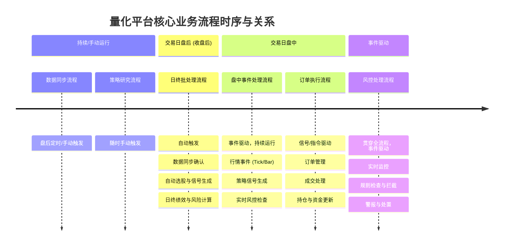
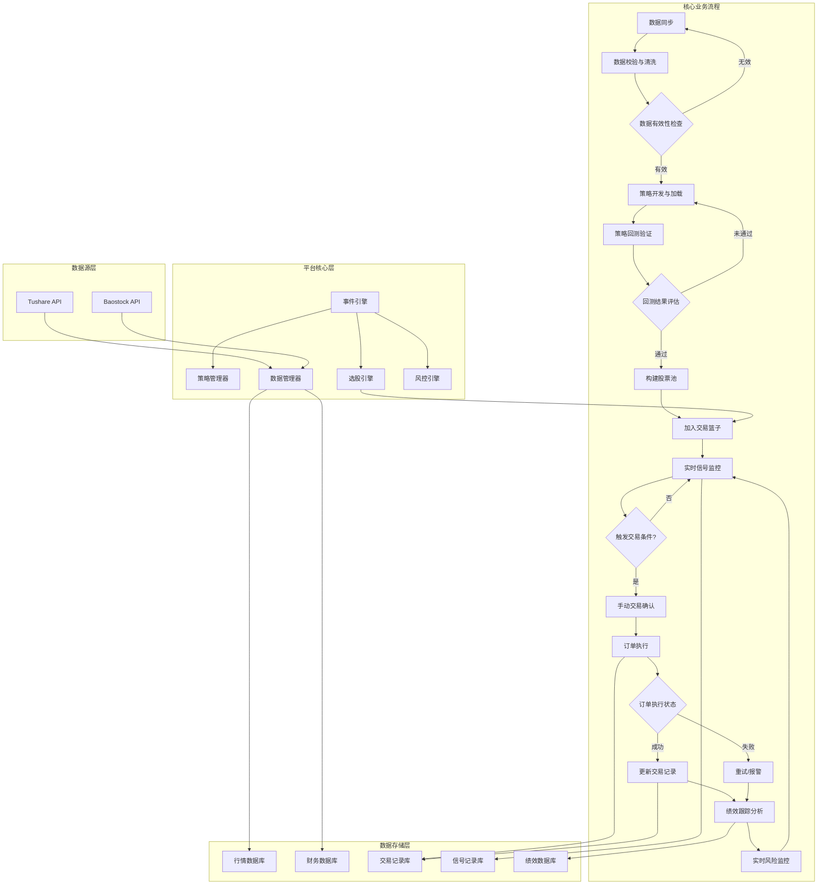
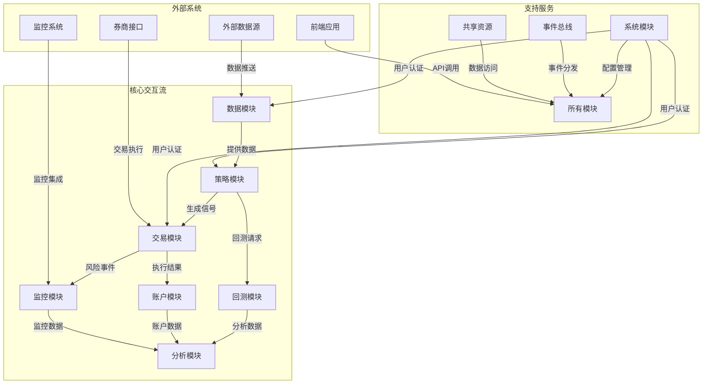
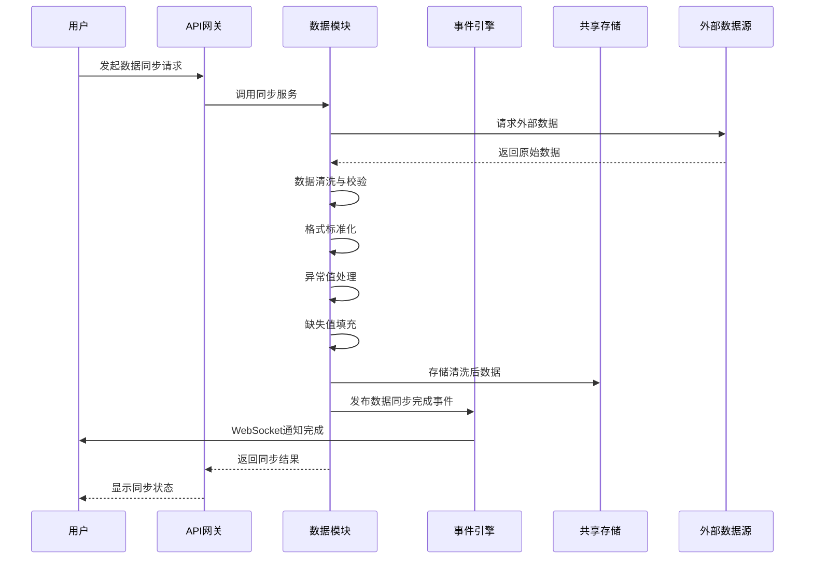
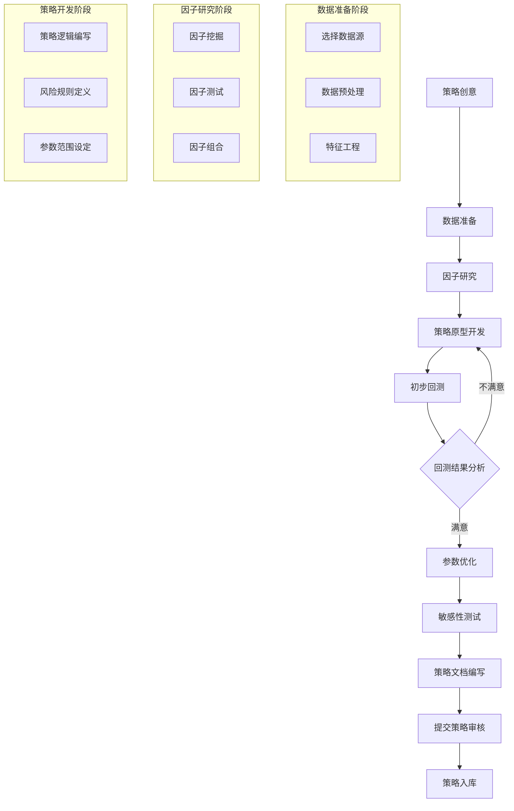
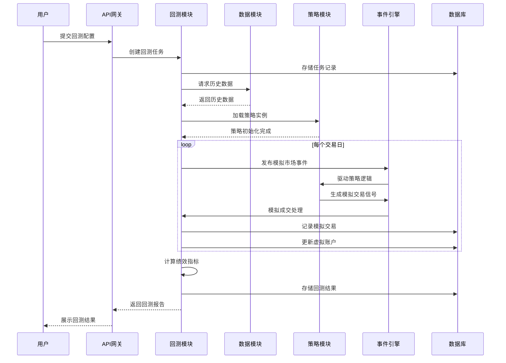
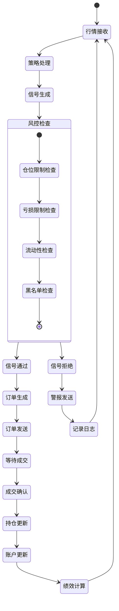
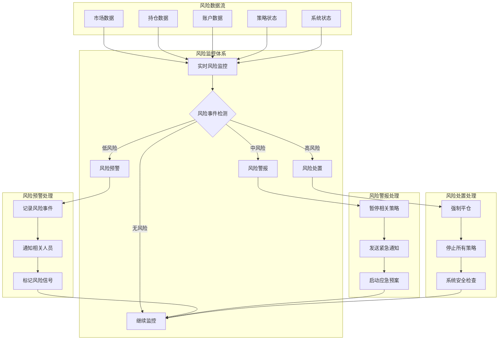
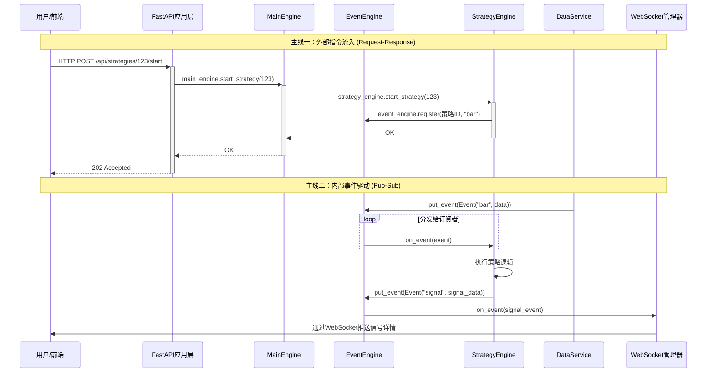
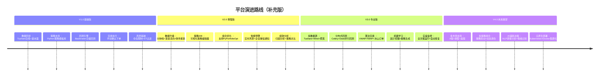

# 量化交易平台方案设计

状态: 进行中
进度: 1
上次编辑时间: 2026年1月17日 13:38
优先级: 中
标签: 方案设计

# 一、项目说明

基于A股市场的量化交易平台

面向个人开发者的轻量化中低频量化交易平台，聚焦 A 股市场日线 / 周线级策略开发、回测验证与半自动交易执行

# 二、业务架构设计

## **2.1 核心流程链路**





### **2.2 系统模块架构**

### 2.2.1 模块职责划分

| **模块名称** | **核心职责** | **关键子组件** | **服务对象** |
| --- | --- | --- | --- |
| **数据模块** | 数据采集、清洗、存储、质量检查、因子研究 | 数据同步引擎、数据质量服务、因子研究引擎 | 所有需要数据的模块 |
| **策略模块** | 策略开发、管理、执行、优化 | 策略管理器、策略执行引擎、策略优化服务 | 策略开发者、研究员 |
| **交易模块** | 信号处理、风控检查、订单执行、持仓管理 | 信号引擎、风控引擎、订单执行引擎 | 交易员、风控人员 |
| **回测模块** | 历史回测、绩效分析、报告生成 | 回测引擎、绩效计算服务、报告生成器 | 策略开发者、研究员 |
| **账户模块** | 资金管理、持仓管理、资金流水 | 账户服务、持仓服务、资金服务 | 交易员、财务人员 |
| **分析模块** | 绩效归因、风险分析、对比分析 | 绩效分析引擎、风险分析服务、对比分析工具 | 投资经理、研究员 |
| **监控模块** | 系统监控、风险监控、日志管理 | 系统健康监控、风险监控器、日志服务 | 运维人员、风控人员 |
| **系统模块** | 用户管理、配置管理、任务调度 | 用户服务、配置服务、任务调度器 | 系统管理员 |

### **2.2.2 模块交互关系**



### 2.3 关键业务流程

### 2.3.1 数据同步-清洗流程



### 2.3.2 策略研究流程



### **2.3.3 回测验证流程**



### **2.3.4 实盘交易流程**



### **2.3.5 风险控制流程**



## **2.3 业务流程设计**

### **1.  回测业务流程与数据流向**

**业务流程**：

1. **用户提交回测请求**：通过前端界面填写回测参数（策略、时间范围、初始资金、标的等）
2. **创建回测任务**：API接收请求，在`backtest_tasks`表中创建新记录，状态为`pending`
3. **后台执行回测**：后台任务从队列中获取任务，更新状态为`running`，开始执行回测
4. **数据加载**：回测引擎从市场数据表中加载所需的历史行情数据
5. **模拟执行**：按时间顺序遍历每个交易日，驱动策略逻辑，记录模拟交易
6. **记录结果**：将每日净值存入`backtest_equity_curves`，交易记录存入`backtest_trades`，持仓快照存入`backtest_positions`
7. **计算指标**：回测完成后，计算汇总指标（年化收益、夏普比率、最大回撤等），更新到`backtest_tasks.result`字段
8. **状态更新**：将任务状态更新为`completed`，记录完成时间
9. **结果展示**：前端通过查询API获取回测结果和详细数据，可视化展示

**数据流向**：

```sql
用户请求 → API → backtest_tasks表 → 回测引擎 → 市场数据表 → 
回测计算 → backtest_equity_curves/backtest_trades/backtest_positions表 → 
结果计算 → backtest_tasks.result字段 → API → 前端展示
```

### **2. API和事件协同工作流程**

**外部请求驱动（Request-Response）** 与 **内部事件驱动（Event-Driven）** 相结合的模式。

1. **主引擎 (MainEngine)**：作为**内部**系统的协调中心，管理和持有所有子引擎的实例。
2. **事件引擎 (EventEngine)**：系统的**中枢神经**，负责在各个内部组件（如策略引擎、风控引擎、数据服务等）之间通过发布-订阅模式进行异步消息传递。
3. **FastAPI (应用层)**：处理所有**外部**HTTP/WebSocket请求，是系统对外的唯一入口。它接收指令，并将其翻译成对核心引擎的调用。



- **流程一：外部指令流入 (FastAPI → MainEngine → 子引擎)**
    
    **详细步骤：**
    
    1. **请求发起**：用户在前端界面点击“启动”按钮，前端发送一个HTTP请求到FastAPI端点：
        - **方法**： `POST`
        - **URL**： `/api/strategies/{strategy_id}/start`
        - **Headers**： `Authorization: Bearer <JWT_TOKEN>`
        - **Body**： 可能包含参数，如 `{"capital": 100000}`
    2. **请求处理 (FastAPI)**：
        - **路由**： FastAPI的`APIRouter`根据URL将请求分发到对应的视图函数，如`start_strategy(strategy_id: str)`。
        - **依赖注入**： 函数首先执行依赖项，验证JWT令牌，确保用户有权限操作该策略。
        - **参数解析**： 使用Pydantic模型验证请求体（如果存在）。
        - **服务调用**： 视图函数通过依赖注入或全局对象获取`MainEngine`实例，并调用其方法：`main_engine.start_strategy(strategy_id, start_params)`。
    3. **指令路由 (MainEngine)**：
        - `MainEngine`并不直接处理业务逻辑，它充当**工厂（Factory）** 和**中介（Mediator）**。
        - 它根据`strategy_id`找到对应的策略配置和所属的策略引擎（如`CTAEngine`）。
        - 它调用具体的策略引擎方法：`strategy_engine.start_strategy(strategy_id)`。
    4. **策略执行 (策略引擎)**：
        - **策略引擎**根据`strategy_id`从数据库或配置文件中加载策略的元信息和代码。
        - **初始化策略**： 实例化策略类，注入数据接口、事件引擎、日志记录器等依赖。
        - **注册事件监听**： 调用策略的`on_init()`方法，该方法通常会向事件引擎订阅它关心的事件，例如：`event_engine.register(EVENT.BAR, self.on_bar)`。
        - **启动策略**： 将策略状态置为**运行中**，并将其加入到策略引擎的活动策略列表中。
    5. **响应返回**：
        - 调用链原路返回成功信号。
        - FastAPI视图函数返回`JSONResponse(status_code=202, content={"msg": "Strategy started"})`。
        - 前端收到响应，更新UI状态（如将按钮变为“停止”）。
- **流程二：内部事件驱动 (事件引擎 → 策略/组件 → 事件引擎 → FastAPI)**
    
    这是系统内部各组件解耦和协作的核心，是一个异步流程。
    
    ```mermaid
    flowchart TD
        A[数据同步服务] -->|推送新行情数据| B[数据服务]
        B --> C[创建 BarEvent 事件]
        C --> D[事件引擎 EventEngine]
        D --> E[查询事件队列]
        E --> F[获取 BarEvent]
        F --> G[分发给所有订阅者<br>策略引擎、风控引擎等]
        G --> H[策略引擎 on_eventbar]
        H --> I[策略逻辑计算]
        I --> J{生成交易信号?}
        J -->|是| K[创建 SignalEvent 事件]
        K --> D
        J -->|否| L[结束]
        G --> M[风控引擎 on_eventbar]
        M --> N[风险检查]
        D --> O[分发给 SignalEvent 订阅者]
        O --> P[WebSocket 管理模块]
        P --> Q[通过 WebSocket 连接]
        Q --> R[前端浏览器]
    ```
    
    **详细步骤：**
    
    1. **事件产生**：
        - **数据同步服务**从Tushare等数据源获取到最新的分钟线或日线行情数据。
        - **数据服务**接收到数据后，对其进行清洗和格式化。
        - 数据服务创建一个`BarEvent`事件对象，包含事件类型（`EVENT.BAR`）和有效载荷（payload），即行情数据（`{'ts_code': '000001.SZ', 'close': 15.2, ...}`）。
        - 数据服务调用`event_engine.put(event)`方法将事件放入事件引擎的队列中。
    2. **事件分发 (事件引擎)**：
        - 事件引擎在一个独立的线程中运行，持续检查其事件队列。
        - 它从队列中取出`BarEvent`。
        - 它查询**事件类型-处理函数**的映射表，找到所有订阅了`EVENT.BAR`事件的处理函数（Handler）。这些处理函数通常属于不同的策略实例和系统模块（如风控引擎）。
        - 事件引擎**异步地**（例如使用线程池）调用这些处理函数，如`handler(event)`。
    3. **事件处理 (策略引擎 - 策略实例)**：
        - 策略实例的`on_bar(self, event)`方法被调用。
        - 策略执行其核心逻辑：计算指标（如MA、MACD）、检查条件。
        - **如果条件满足**，策略生成一个交易信号（Signal），例如：“在[000001.SZ](https://000001.sz/)的当前价格15.2元买入1000股”。
        - 策略实例创建一个`SignalEvent`事件，包含信号详情，并再次调用`event_engine.put(signal_event)`将该事件放入队列。
    4. **事件处理 (其他组件)**：
        - **风控引擎**同样订阅了`EVENT.BAR`，它会对实时行情进行监控，检查持仓风险、账户净值等是否超过阈值。如果超标，它可能会产生一个`RiskEvent`事件来警告或停止策略。
    5. **信号输出 (WebSocket推送)**：
        - `SignalEvent`被事件引擎从队列中取出。
        - 事件引擎将其分发给订阅者。其中一个重要的订阅者是**FastAPI层内的WebSocket管理模块**。
        - WebSocket管理模块将`SignalEvent`转换为JSON格式。
        - 它通过维护的活跃WebSocket连接，将信号数据实时推送给前端界面。推送格式可能为：
        - 前端收到WebSocket消息后，弹出桌面通知、更新信号列表、或展示在交易驾驶舱中。
        
        ```json
        {
          "event": "signal",
          "data": {
            "strategy_id": "strategy_123",
            "ts_code": "000001.SZ",
            "datetime": "2025-09-07 14:30:00",
            "signal_type": "BUY",
            "price": 15.2,
            "volume": 1000,
            "message": "双均线金叉买入信号"
          }
        }
        ```
        

### **3. 前端业务操作流程**

- **第一阶段：策略研究与开发**
    1. **数据准备**（市场数据模块）
        - 查看股票、ETF、指数的历史数据和实时行情
        - 通过数据同步确保数据完整性和时效性
    2. **因子研究**（因子研究模块）
        - 研究各类Alpha因子
        - 测试因子有效性和稳定性
        - 构建因子库
    3. **策略创建**（策略管理模块）
        - 基于研究成果创建新策略
        - 设置策略参数和逻辑
        - 配置交易品种和频率
- **第二阶段：回测与优化**
    1. **回测验证**（回测工作室）
        - 在历史数据上运行策略
        - 模拟真实交易环境（考虑滑点、手续费）
        - 生成回测报告
    2. **绩效评估**（绩效分析模块）
        - 分析策略绩效指标（夏普比率、最大回撤等）
        - 与基准进行比较
        - 进行归因分析
    3. **策略优化**（策略管理模块）
        - 根据回测结果调整参数
        - 优化策略逻辑
        - 设置黑名单（风险管理模块
- **第三阶段：实盘准备**
    1. **风控配置**（风险管理模块）
        - 设置仓位限制、止损规则
        - 配置实时风控阈值
        - 建立事件响应机制
    2. **交易篮子配置**（篮子管理模块）
        - 创建策略适用的股票篮子
        - 设置权重和调仓规则
        - 验证篮子完整性
    3. **系统准备**（系统管理模块）
        - 确保数据同步正常
        - 配置交易账户和权限
        - 设置监控和报警规则
- **第四阶段：实盘运行**
    1. **信号监控**（信号监控模块）
        - 实时监控策略信号生成
        - 验证信号逻辑和准确性
        - 记录信号历史
    2. **风险控制**（风险管理模块）
        - 实时风控检查信号合规性
        - 检查黑名单和限制规则
        - 监控系统风险和市场风险
    3. **交易执行**（交易执行模块）
        - 交易驾驶舱查看待执行信号
        - 自动/手动执行订单
        - 订单管理跟踪执行状态
- **第五阶段：交易后处理**
    1. **持仓管理**（交易执行模块）
        - 实时更新持仓信息
        - 监控账户资金变化
        - 处理分红送股等公司行动
    2. **持续监控**（多个模块）
        - 信号监控：持续跟踪新信号
        - 风险管理：实时风险预警
        - 系统监控：系统稳定性保障
    3. **绩效分析**（绩效分析模块）
        - 实时更新策略绩效
        - 对比实盘与回测表现
        - 生成每日/每周绩效报告
- **第六阶段：优化迭代**
    1.  **数据分析**（绩效分析 + 市场数据）
        - 分析策略表现归因
        - 识别策略失效或衰减
        - 寻找优化机会
    2. **策略迭代**（策略管理模块）
        - 基于实盘表现调整策略
        - 重新回测验证改进
        - 部署优化后的策略版本

### 4. 数据同步设计

- **4.1.核心特性**
    - **批量操作**：支持多种数据类型同时同步
    - **统一接口**：提供标准化的同步状态管理和进度追踪
    - **向后兼容**：保留原有单个数据类型同步接口
    - **实时反馈**：提供详细的同步进度和状态信息
    - **错误隔离**：单个数据类型失败不影响其他类型同步
- **4.2.架构设计**
    - 系统架构图
        
        ```mermaid
        graph TB
            subgraph Frontend [前端界面]
                A[数据同步配置页面] --> B[复选框选择数据类型]
                B --> C[设置同步参数]
                C --> D[发起批量同步请求]
            end
        
            subgraph API Layer [API接口层]
                D --> E[POST /data-sync/batch-sync]
                F[GET /data-sync/status]
                G[POST /data-sync/cancel]
                H[GET /data-sync/supported-data-types]
            end
        
            subgraph Service Layer [服务层]
                E --> I[DataSyncService]
                I --> J[数据类型验证]
                J --> K[状态初始化]
                K --> L[后台任务启动]
            end
        
            subgraph Data Layer [数据层]
                L --> M[股票基础信息同步]
                L --> N[行情数据同步]
                L --> O[财务数据同步]
                L --> P[资金流向同步]
                L --> Q[其他数据类型同步]
            end
        
            subgraph Status Management [状态管理]
                R[内存状态存储]
                S[进度更新机制]
                T[错误处理]
                U[状态重置]
            end
        
            M --> R
            N --> R
            O --> R
            P --> R
            Q --> R
            
            F --> R
            G --> R
        ```
        
    - 数据流图
        
        ```mermaid
        sequenceDiagram
            participant Frontend as 前端界面
            participant API as API接口
            participant Status as 状态管理器
            participant Service as 数据同步服务
            participant External as 外部数据源
        
            Frontend->>API: POST /batch-sync
            Note over Frontend,API: 包含数据类型列表和参数
            
            API->>Status: 检查当前状态
            Status-->>API: 返回状态信息
            
            alt 有任务运行中
                API-->>Frontend: 返回409错误
            else 无任务运行
                API->>Status: 重置并初始化状态
                API->>Service: 启动后台同步任务
                API-->>Frontend: 返回任务ID和预估时间
                
                par 前端轮询状态
                    loop 每隔2秒
                        Frontend->>API: GET /status
                        API->>Status: 获取状态
                        Status-->>API: 返回进度信息
                        API-->>Frontend: 返回状态响应
                    end
                and 后台同步执行
                    loop 每个数据类型
                        Service->>Status: 更新当前任务和进度
                        Service->>External: 请求数据
                        External-->>Service: 返回数据
                        Service->>Service: 数据处理和存储
                        Service->>Status: 更新结果
                    end
                end
                
                Service->>Status: 标记任务完成
                Frontend->>Frontend: 显示完成状态
            end
        ```
        
- 4.3.接口核心设计
    - 核心接口
        1. 批量同步接口
            
            ```python
            POST /api/data-sync/batch-sync
            Content-Type: application/json
            
            {
              "data_types": ["stock_list", "daily_quotes", "money_flow"],
              "days": 30,
              "start_date": "20240101",
              "end_date": "20241231",
              "stock_codes": ["000001.SZ", "600000.SH"],
              "exchange": "SSE",
              "batch_size": 100
            }
            ```
            
        2. 状态查询接口
            
            ```python
            GET /api/data-sync/status
            ```
            
        3. 支持的数据类型接口
            
            ```python
            GET /api/data-sync/supported-data-types
            ```
            
    - 数据模型
        1. 批量同步请求模型
            
            ```python
            class BatchSyncRequest:
                data_types: List[str]      # 数据类型列表
                days: int                  # 同步天数
                start_date: Optional[str]  # 开始日期
                end_date: Optional[str]    # 结束日期
                stock_codes: List[str]     # 指定股票代码
                exchange: Optional[str]    # 交易所代码
                batch_size: int           # 批量处理大小
            ```
            
        2. 同步状态模型
            
            ```python
            class SyncStatus:
                is_running: bool           # 是否正在运行
                progress: int              # 进度百分比
                current_task: str          # 当前任务名称
                results: Dict[str, Any]    # 同步结果
                error: Optional[str]       # 错误信息
                total_tasks: int          # 总任务数
                completed_tasks: int      # 已完成任务数
                elapsed_time: int         # 已运行时间
            ```
            
- 4.4.状态管理设计
    - 1. 状态生命周期
        
        ```mermaid
        stateDiagram-v2
            [*] --> Idle: 系统启动
            Idle --> Initializing: 接收同步请求
            Initializing --> Validating: 初始化状态
            Validating --> Running: 验证数据类型
            Running --> Processing: 启动后台任务
            state Running {
                [*] --> Task1
                Task1 --> Task2
                Task2 --> Task3
                Task3 --> [*]
            }
            Processing --> Completed: 所有任务完成
            Processing --> Error: 发生错误
            Processing --> Cancelled: 用户取消
            Completed --> Idle: 重置状态
            Error --> Idle: 重置状态
            Cancelled --> Idle: 重置状态
        ```
        
    - 状态存储机制
        1. 内存状态结构
            
            ```python
            sync_status = {
                "last_run": datetime,      # 最后运行时间
                "is_running": bool,        # 运行状态
                "progress": int,           # 进度百分比
                "current_task": str,       # 当前任务
                "results": dict,           # 同步结果
                "error": str,              # 错误信息
                "total_tasks": int,        # 总任务数
                "completed_tasks": int,    # 已完成数
                "start_time": datetime,    # 开始时间
                "task_id": str            # 任务ID
            }
            ```
            
        2. 状态重置策略
            - **任务开始时**：完全重置状态，清理历史数据
            - **任务完成后**：保留结果但标记为未运行
            - **系统重启时**：状态自动重置为空闲状态
- 4.5.错误处理设计
    
    
    | **错误类型** | **处理方式** | **影响范围** |
    | --- | --- | --- |
    | 数据类型无效 | 跳过无效类型，继续其他类型 | 单个类型 |
    | 网络超时 | 重试机制，最多3次 | 单个类型 |
    | 数据格式错误 | 记录错误，继续其他类型 | 单个类型 |
    | 系统异常 | 停止整个同步任务 | 所有类型 |
    
    错误恢复流程
    
    ```mermaid
    graph LR
        A[同步开始] --> B{数据类型验证}
        B -->|无效类型| C[记录警告并跳过]
        B -->|有效类型| D[执行同步]
        D --> E{同步成功?}
        E -->|是| F[记录成功结果]
        E -->|否| G[错误重试机制]
        G --> H{重试次数<3?}
        H -->|是| D
        H -->|否| I[记录错误结果]
        F --> J[继续下一个类型]
        I --> J
        C --> J
        J --> K{所有类型完成?}
        K -->|否| B
        K -->|是| L[同步完成]
    ```
    
- 4.6.性能优化
    
    ### **批量处理优化**
    
    - **分批处理**：避免单次请求数据量过大
    - **并行处理**：支持多个数据类型的并发同步
    - **内存管理**：及时清理临时数据，避免内存泄漏

### **批量处理优化**

- **分批处理**：避免单次请求数据量过大
- **并行处理**：支持多个数据类型的并发同步
- **内存管理**：及时清理临时数据，避免内存泄漏

# 三、技术架构

本方案采用**混合架构**设计，采用**以模块化为主，适度分层为辅的混合架构，**将系统分为前端展示层、API网关层、核心引擎层、数据服务层和存储层，实现前后端分离的高性能量化交易平台。

### **1. 混合架构说明**

[https://www.notion.so/2cf7ca4a7e1680c5a5d3d40361deecca?v=2447ca4a7e168024a954000cfcdb9ab8&source=copy_link](https://www.notion.so/2cf7ca4a7e1680c5a5d3d40361deecca?pvs=21)

本平台采用**稳定层（分层架构）+ 灵活层（模块化架构）**的混合架构设计：

- **1、稳定层（分层架构）**：
    - 提供系统运行的基础框架和基础设施
    - 变化频率低，确保系统核心稳定性
    - 包括API网关层、核心基础设施层、共享资源层
- **2、灵活层（模块化架构）**：
    - 实现具体业务功能，支持快速迭代
    - 各模块独立开发、测试、部署
    - 通过事件总线实现松耦合通信
    - 包括数据、策略、交易、回测等业务模块
- **3、通信中枢**：
    - 事件引擎作为系统神经中枢
    - 基于发布-订阅模式实现模块间通信
    - 支持同步和异步两种通信方式

### **2. 前端 (Vue 3 + TypeScript)**

**图标组件：**`@iconify/vue`、**Naive UI** 

**前端样式：**使用 theme.json 文件，进行全局控制整个应用的主题样式，不用创建主题管理器，我可以直接修改theme.json文件，可以在文件中提前预定义多个主题，加一个当前生效主题字段，由我自己配置，

**核心作用**：提供用户交互界面，可视化展示数据和策略效果

- **菜单设计：**
    
    ```
    ├**── 数据中心：负责数据获取、管理与研究**
    │   ├── 市场数据浏览器
    │   │   ├── 股票/ETF/指数行情
    │   │   ├── 行业/板块/概念
    │   │   ├── 资金流向监控
    │   │   └── 市场热力图
    │   │
    │   ├── 数据同步中心
    │   │   ├── 同步任务管理
    │   │   ├── 同步进度监控
    │   │   ├── 同步历史记录
    │   │   └── 同步配置
    │   │
    │   ├── 数据质量报告
    │   │   ├── 完整性检查
    │   │   ├── 异常检测
    │   │   └── 数据修复
    │   │
    │   └── 因子研究平台
    │       ├── 因子库浏览
    │       ├── 因子有效性测试
    │       ├── 因子组合构建
    │       └── 因子回测分析
    ├── **策略中心：负责策略开发、测试与组合配置**
    │   ├── 策略工作室
    │   │   ├── 策略列表（我的策略/模板库）
    │   │   ├── 策略编辑器（在线编辑/代码上传）
    │   │   ├── 策略版本管理
    │   │   └── 策略参数配置
    │   │
    │   ├── 回测工作台
    │   │   ├── 新建回测任务
    │   │   ├── 回测任务队列
    │   │   ├── 回测报告详情
    │   │   └── 回测参数优化
    │   │
    │   └── 策略组合配置
    │       ├── 策略组合列表
    │       ├── 策略权重分配
    │       ├── 组合回测验证
    │       └── 组合风险管理
    **├── 交易中心：负责交易准备、执行与监控**
    │   ├── 交易驾驶舱（实时）
    │   │   ├── 实时信号流
    │   │   ├── 快速交易面板
    │   │   ├── 账户状态概览
    │   │   └── 关键风险指标
    │   │
    │   ├── 交易篮子管理
    │   │   ├── 篮子列表（按策略分类）
    │   │   ├── 篮子详情与编辑
    │   │   ├── 篮子回测验证
    │   │   └── 生成交易指令
    │   │
    │   ├── 执行清单
    │   │   ├── 待执行交易
    │   │   ├── 执行计划预览
    │   │   ├── 批量确认执行
    │   │   └── 执行历史记录
    │   │
    │   └── 订单管理
    │       ├── 订单列表（状态筛选）
    │       ├── 订单详情与撤单
    │       ├── 成交明细查询
    │       └── 订单执行分析
    ├── **账户中心：负责账户资产与持仓管理**
    │   ├── 我的持仓
    │   │   ├── 持仓明细（股票/ETF）
    │   │   ├── 持仓分析（行业/市值分布）
    │   │   ├── 持仓盈亏统计
    │   │   └── 调仓计划
    │   │
    │   ├── 账户总览
    │   │   ├── 资产总览（总资产/现金/市值）
    │   │   ├── 资金曲线
    │   │   ├── 当日盈亏
    │   │   └── 风险指标概览
    │   │
    │   └── 资金流水
    │       ├── 资金变动记录
    │       ├── 费用明细（佣金/税费）
    │       ├── 出入金管理
    │       └── 资金对账
    ├── **分析中心：负责绩效评估与归因分析**
    │   ├── 绩效仪表盘
    │   │   ├── 自定义看板
    │   │   ├── 关键指标总览
    │   │   ├── 净值曲线对比
    │   │   └── 月度收益热图
    │   │
    │   ├── 策略绩效分析
    │   │   ├── 单策略绩效详情
    │   │   ├── 策略对比分析
    │   │   ├── 策略稳定性分析
    │   │   └── 策略相关性矩阵
    │   │
    │   ├── 账户绩效分析
    │   │   ├── 收益归因分析
    │   │   ├── 风险归因分析
    │   │   ├── 持仓贡献度分析
    │   │   └── 基准对比分析
    │   │
    │   └── 交易分析
    │       ├── 交易成本分析
    │       ├── 交易执行质量
    │       ├── 交易行为分析
    │       └── 交易日志查询
    ├── **监控中心:负责系统状态、风险与事件监控**
    │   ├── 实时监控面板
    │   │   ├── 系统健康状态
    │   │   ├── 数据流监控
    │   │   ├── 引擎运行状态
    │   │   └── 连接状态监控
    │   │
    │   ├── 风险管理
    │   │   ├── 实时风控仪表盘
    │   │   ├── 风控规则配置
    │   │   ├── 风险事件日志
    │   │   └── 黑名单管理
    │   │
    │   ├── 日终处理控制台
    │   │   ├── 数据同步状态
    │   │   ├── 自动选股任务
    │   │   ├── 信号生成监控
    │   │   └── 批处理日志
    │   │
    │   └── 报警中心
    │       ├── 报警规则配置
    │       ├── 报警历史记录
    │       ├── 报警方式管理
    │       └── 报警级别设置
    ├── **系统管理:负责平台配置与用户管理**
    │   ├── 用户与权限
    │   │   ├── 用户管理
    │   │   ├── 角色管理
    │   │   ├── 权限分配
    │   │   └── 操作日志
    │   │
    │   ├── 系统配置
    │   │   ├── 全局参数设置
    │   │   ├── 交易账户配置
    │   │   ├── 数据源配置
    │   │   └── 券商接口配置
    │   │
    │   ├── 任务调度管理
    │   │   ├── 定时任务列表
    │   │   ├── 任务执行历史
    │   │   ├── 任务依赖配置
    │   │   └── 任务监控
    │   │
    │   └── 系统日志
    │       ├── 系统运行日志
    │       ├── 错误日志查询
    │       ├── 审计日志
    │       └── 日志归档管理
    ```
    
- **页面渲染与组件调用流程**
    
    ```mermaid
    sequenceDiagram
        participant R as Router
        participant L as Layout
        participant V as View
        participant C as Component
        participant S as Store
        participant A as API
        
        R->>L: 根据路由匹配Layout
        L->>V: 加载对应View
        V->>S: dispatch('module/init')
        S->>A: API调用获取数据
        A-->>S: 返回数据
        S-->>V: 更新state
        V->>C: 渲染子组件
        C->>C: 组件内部逻辑
        C->>S: 用户交互触发action
        S->>A: 提交数据
        A-->>S: 操作结果
        S-->>C: 更新界面状态
    ```
    

# 四、平台演进路线



[https://www.notion.so](https://www.notion.so)