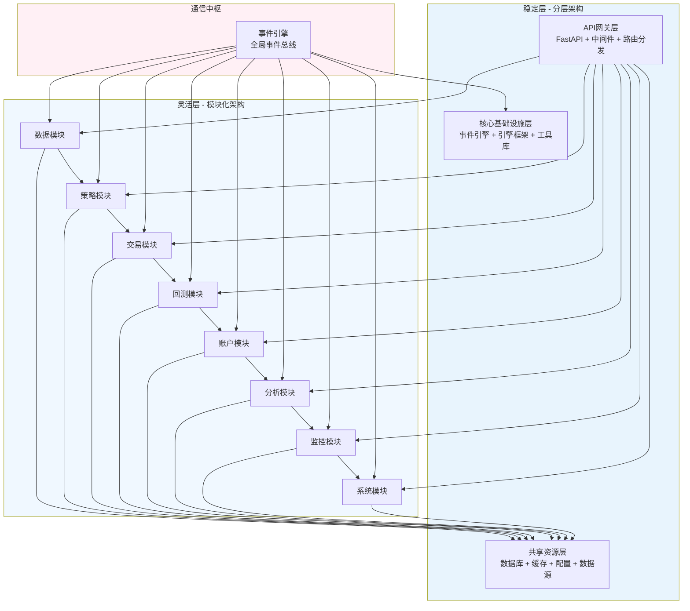
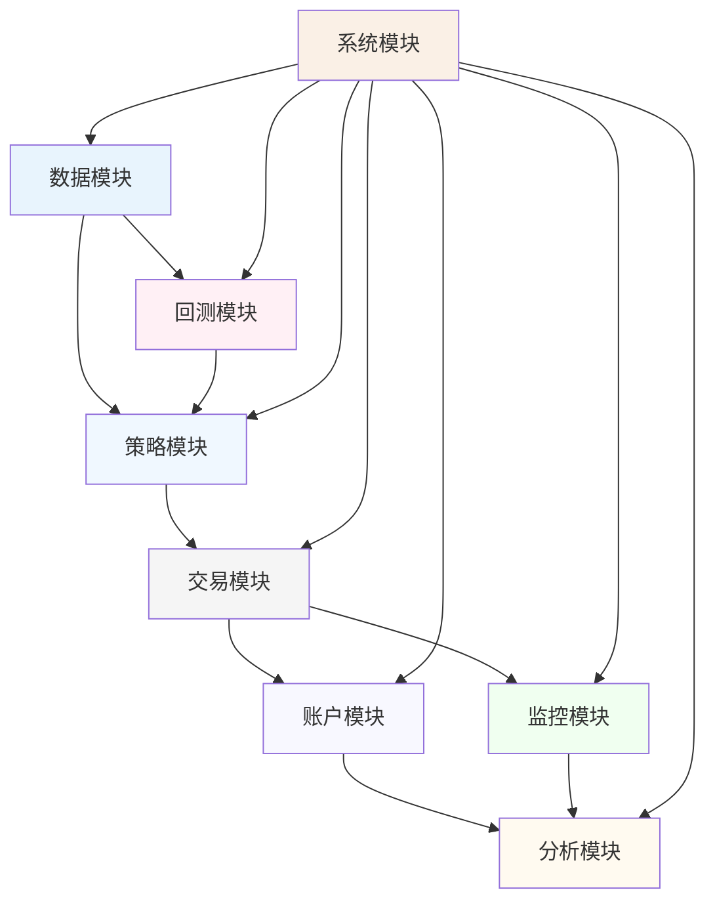
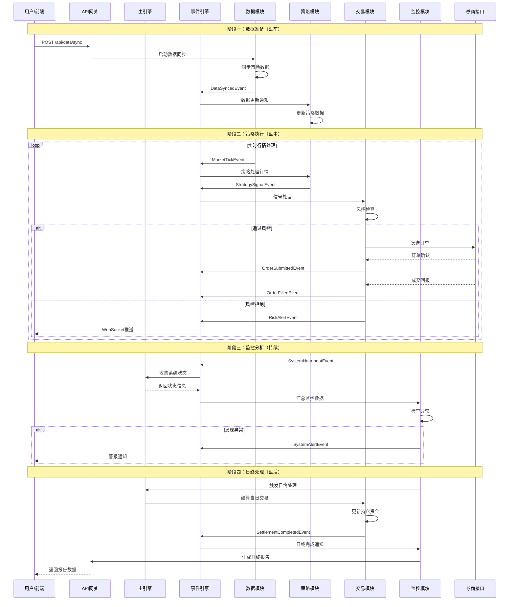
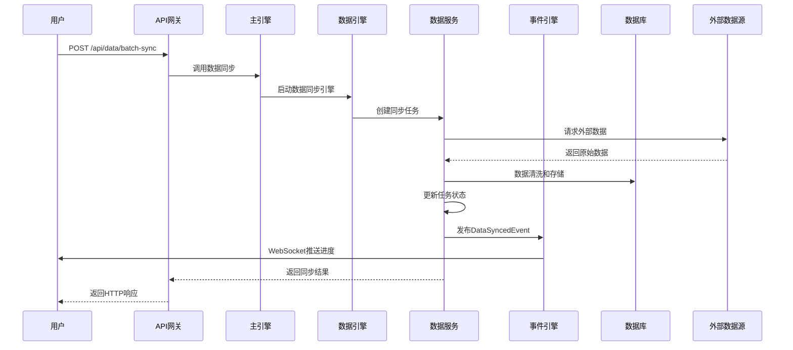
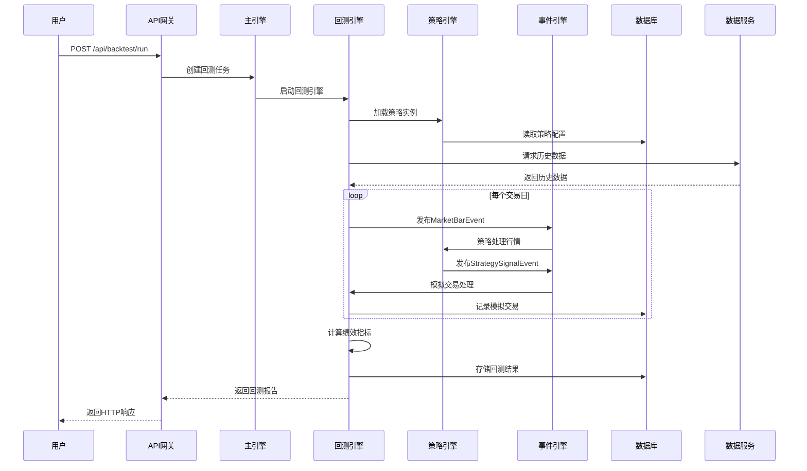
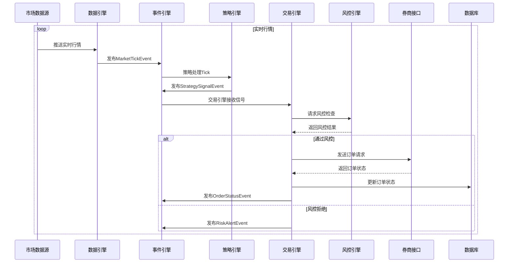
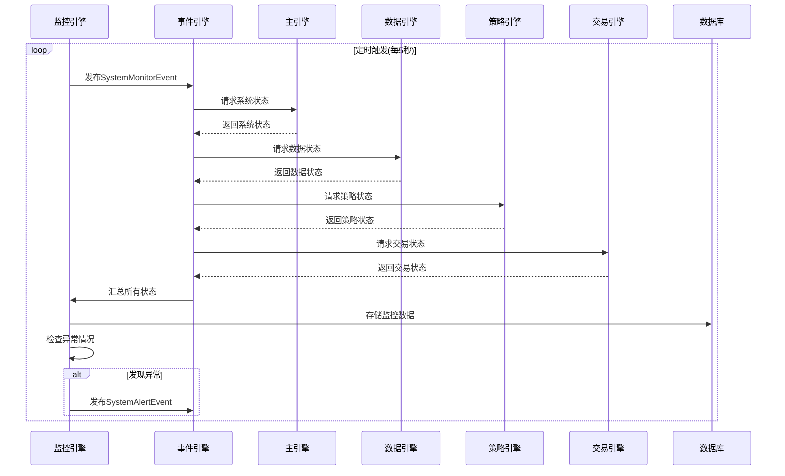

# 量化交易系统-混合架构设计

状态: 完成
进度: 1
上次编辑时间: 2026年1月17日 18:55
标签: 方案设计

返回主设计：[https://www.notion.so/2447ca4a7e16806eaab5d2318723a004?v=2447ca4a7e168024a954000cfcdb9ab8&source=copy_link](https://www.notion.so/2447ca4a7e16806eaab5d2318723a004?pvs=21)

基于原功能设计和混合架构原则，我重新设计系统的完整层次结构，确保架构清晰、逻辑通顺、无功能重复。

## **一、架构层次总览**



---

## **二、问题解答：共享层与业务模块的关系**

**问题1：业务模块中的schemas和repositories是否可以使用公共的？**

**答案：采用分层设计，职责明确，避免重复**

| **组件** | **位置** | **用途** | **是否可共享** | **设计原则** |
| --- | --- | --- | --- | --- |
| **数据表模型** | `shared/database/models/` | 数据库表结构定义 | ✅ 必须共享 | 所有模块使用统一的ORM模型 |
| **Repository** | `shared/database/repositories/` | 数据访问层 | ✅ 必须共享 | 统一数据访问接口，避免SQL重复 |
| **Pydantic Schemas** | `modules/{module}/schemas.py` | API请求/响应验证 | ❌ 独立定义 | 每个模块根据API需求独立定义 |
| **业务模型** | `modules/{module}/models.py` | 业务逻辑对象 | ❌ 独立定义 | 包含业务逻辑的领域模型 |

**设计原则**：

1. **数据表模型统一**：所有数据库表定义在`shared/database/models/`，确保表结构一致性
2. **Repository统一**：数据访问层在`shared/database/repositories/`，提供统一CRUD接口
3. **API Schemas独立**：每个模块根据API需求定义自己的Pydantic模型
4. **业务模型独立**：包含业务逻辑的领域对象在各模块内部定义

**示例**：

---

## **三、完整架构层次设计**

### **1. API网关层（api/）**

**定位**：系统统一入口，负责请求路由、认证、限流、日志、响应格式化

**目录结构**：

```
api/
├── __init__.py
├── main.py                    # FastAPI应用主入口
│
├── middleware/                # 中间件层
│   ├── __init__.py
│   ├── auth.py               # JWT认证中间件
│   ├── rate_limit.py         # 请求限流中间件
│   ├── logging.py            # 访问日志中间件
│   ├── cors.py               # CORS跨域中间件
│   ├── exception.py          # 全局异常处理中间件
│   └── request_id.py         # 请求ID跟踪中间件
│
├── dependencies/              # 依赖注入
│   ├── __init__.py
│   ├── database.py           # 数据库会话依赖
│   ├── auth.py               # 认证依赖（获取当前用户）
│   ├── config.py             # 配置依赖
│   ├── event_engine.py       # 事件引擎依赖
│   └── main_engine.py        # 主引擎依赖
│
├── routers/                   # 路由注册（整合所有模块API）
│   ├── __init__.py
│   ├── data_router.py        # 数据模块路由
│   ├── strategy_router.py    # 策略模块路由
│   ├── trade_router.py       # 交易模块路由
│   ├── backtest_router.py    # 回测模块路由
│   ├── account_router.py     # 账户模块路由
│   ├── analysis_router.py    # 分析模块路由
│   ├── monitor_router.py     # 监控模块路由
│   └── system_router.py      # 系统模块路由
│
├── websocket/                # WebSocket管理
│   ├── __init__.py
│   ├── manager.py            # WebSocket连接管理器
│   ├── handlers/             # WebSocket处理器
│   │   ├── __init__.py
│   │   ├── market_handler.py    # 行情推送
│   │   ├── signal_handler.py    # 信号推送
│   │   ├── order_handler.py     # 订单状态推送
│   │   └── system_handler.py    # 系统状态推送
│   └── events.py             # WebSocket事件定义
│
├── health/                   # 健康检查
    ├── __init__.py
    ├── endpoints.py          # 健康检查端点
    └── probes.py             # 就绪性和存活探针

```

### **2. 核心基础设施层（core/）**

**定位**：系统稳定骨架，提供事件驱动框架、引擎基类、事件定义、核心工具

**目录结构**：

```
core/
├── __init__.py
├── constants.py              # 核心常量
│
├── engines/                  # 引擎框架
│   ├── __init__.py
│   ├── base/                # 引擎基类
│   │   ├── __init__.py
│   │   └── engine_base.py               # 引擎基类（所有引擎的统一抽象）
│   │                                      #   — 生命周期：start/stop/restart/pause/resume
│   │                                      #   — 状态管理、依赖注入、错误恢复、健康检查
│   │                                      #   — 业务引擎直接继承此基类，无需中间层
│   │
│   ├── types/               # 引擎类型定义 ★
│   │   ├── __init__.py
│   │   ├── enums.py                     # 引擎状态枚举（ComponentStatus/HealthStatus/
│   │   │                                 #   PriorityLevel/EngineType/EngineErrorLevel/
│   │   │                                 #   ResourceType）
│   │   └── entities.py                  # 引擎数据实体（EngineMetricsEntity/
│   │                                     #   EventEntity/EngineConfigEntity）
│   │
│   ├── system/              # 系统引擎
│   │   ├── __init__.py
│   │   ├── main_engine.py              # 主引擎（协调中心）
│   │   ├── event_engine.py             # 事件引擎（消息总线）实现
│   │   └── engine_registry.py          # 引擎注册表
│   │
│   └── utils/               # 引擎工具
│       ├── __init__.py
│       ├── engine_factory.py           # 引擎工厂
│       └── engine_monitor.py           # 引擎监控器
│
├── events/                  # 核心事件框架（仅框架，不含业务事件定义）
│   ├── __init__.py
│   ├── base.py                 # BaseEvent — 所有事件的抽象基类
│   ├── types.py                # 事件类型常量与枚举定义
│   ├── engine.py               # 事件引擎类（与主引擎集成）
│   ├── system_events.py        # 系统级事件定义（如SystemStartedEvent等）
│   └── framework.py            # 事件框架工具类
│
├── patterns/               # 设计模式实现
│   ├── __init__.py
│   ├── singleton.py               # 单例模式
│   ├── observer.py                # 观察者模式
│   ├── factory.py                 # 工厂模式
│   ├── strategy_pattern.py        # 策略模式
│   ├── command.py                 # 命令模式
│   └── state_machine.py           # 状态机
│
├── exceptions/                  # 异常模块
│   ├──__init__.py                   # 统一导出异常
│   ├──base.py                       # 异常基类
│   ├──error_codes.py                # 错误码定义
│   ├──handlers.py                   # 异常处理器
│   ├──middleware.py                 # 异常中间件
│   ├──
│   ├──system_exceptions.py          # 系统异常
│   ├──business_exceptions.py        # 业务异常（按领域组织）
│   ├──validation_exceptions.py      # 验证异常
└── middleware/
    ├── __init__.py
    ├── exception.py         # 全局异常处理
    ├── auth.py             # 业务认证逻辑
    ├── validation.py       # 业务数据验证
    └── monitoring.py       # 业务监控

```

### **3. 共享资源层（shared/）**

**定位**：公共基础设施，提供数据库、缓存、配置、数据源等共享服务

**目录结构**：

```python
shared/
├── __init__.py
├── constants.py              # 共享常量
│
├── database/                # 数据库基础设施
│   ├── __init__.py
│   ├── session.py           # 数据库会话管理
│   │   ├── session_manager.py    # 会话管理器
│   │   ├── connection_pool.py    # 连接池
│   │   └── transaction.py        # 事务管理
│   │
│   ├── models/              # 数据表模型（统一ORM模型）
│   │   ├── __init__.py
│   │   ├── base.py                # 模型基类
│   │   ├── mixins.py              # 模型混入类
│   │   ├── data_models.py         # 数据相关表模型
│   │   │   ├── stock_models.py    # 股票相关表
│   │   │   ├── quote_models.py    # 行情相关表
│   │   │   ├── financial_models.py # 财务数据表
│   │   │   └── factor_models.py   # 因子数据表
│   │   │
│   │   ├── business_models.py     # 业务相关表模型
│   │   │   ├── strategy_models.py # 策略相关表
│   │   │   ├── trade_models.py    # 交易相关表
│   │   │   ├── account_models.py  # 账户相关表
│   │   │   └── risk_models.py     # 风险相关表
│   │   │
│   │   └── system_models.py       # 系统相关表模型
│   │       ├── user_models.py     # 用户表
│   │       ├── config_models.py   # 配置表
│   │       ├── log_models.py      # 日志表
│   │       └── task_models.py     # 任务表
│   │
│   ├── repositories/        # 数据仓库（Repository模式）一表一仓库
│   │   ├── __init__.py                          # Repository统一导出
│   │   ├── base/                               # Repository基类
│   │   │   ├── __init__.py
│   │   │   ├── repository_base.py               # Repository基类
│   │   │   ├── hyper_repository_base.py         # 超表Repository基类
│   │   │   ├── pagination.py                    # 分页基类
│   │   │   └── query_builder.py                 # 查询构建器
│   │   │
│   │   ├── system/                             # 系统核心领域
│   │   │   ├── __init__.py
│   │   │   ├── auth/                           # 用户与权限
│   │   │   │   ├── __init__.py
│   │   │   │   ├── user_repository.py          # 系统用户表
│   │   │   │   ├── role_repository.py          # 角色表
│   │   │   │   └── permission_repository.py    # 权限表
│   │   │   ├── config/                         # 配置与日志
│   │   │   │   ├── __init__.py
│   │   │   │   ├── config_repository.py        # 系统配置表
│   │   │   │   ├── operation_log_repository.py # 操作日志表
│   │   │   │   ├── audit_log_repository.py     # 审计日志表
│   │   │   │   ├── notification_repository.py  # 系统通知表
│   │   │   │   ├── user_preference_repository.py  # 用户偏好设置表
│   │   │   │   └── api_usage_repository.py     # API使用日志表
│   │   │   └── ops/                            # 系统运维
│   │   │       ├── __init__.py
│   │   │       ├── health_metric_repository.py # 系统健康指标表
│   │   │       ├── license_repository.py       # 许可证密钥表
│   │   │       └── scheduled_task_repository.py # 定时任务表
│   │   │
│   │   ├── market/                             # 市场数据领域
│   │   │   ├── __init__.py
│   │   │   ├── basic/                          # 基础信息
│   │   │   │   ├── __init__.py
│   │   │   │   ├── stock_basic_repository.py   # 股票基础信息表
│   │   │   │   ├── company_repository.py       # 公司信息表
│   │   │   │   ├── st_list_repository.py       # ST股票列表表
│   │   │   │   ├── etf_basic_repository.py     # ETF基础信息表
│   │   │   │   ├── etf_index_repository.py     # ETF指数信息表
│   │   │   │   ├── fund_basic_repository.py    # 基金基础信息表
│   │   │   │   └── index_basic_repository.py   # 指数基础信息表
│   │   │   ├── quote/                          # 行情数据（时序超表）
│   │   │   │   ├── __init__.py
│   │   │   │   ├── stock_daily_repository.py   # 股票日行情表 [超表]
│   │   │   │   ├── stock_minute_repository.py  # 股票分钟行情表 [超表]
│   │   │   │   ├── stock_weekly_repository.py  # 股票周行情表 [超表]
│   │   │   │   ├── stock_monthly_repository.py # 股票月行情表 [超表]
│   │   │   │   ├── stock_adj_factor_repository.py # 股票复权因子表 [超表]
│   │   │   │   ├── stock_adjusted_price_repository.py # 股票复权价格表 [超表]
│   │   │   │   ├── stock_daily_limit_repository.py # 股票涨跌停价格表 [超表]
│   │   │   │   ├── etf_daily_repository.py     # ETF日行情表 [超表]
│   │   │   │   ├── etf_minute_repository.py    # ETF分钟行情表 [超表]
│   │   │   │   └── fund_adj_factor_repository.py # 基金复权因子表 [超表]
│   │   │   ├── fundamental/                    # 财务与基本面
│   │   │   │   ├── __init__.py
│   │   │   │   ├── stock_daily_basic_repository.py # 股票每日基础指标表 [超表]
│   │   │   │   ├── stock_moneyflow_repository.py # 股票资金流向表 [超表]
│   │   │   │   ├── financial_statement_repository.py # 财务报表数据表
│   │   │   │   └── company_announcement_repository.py # 公司公告表
│   │   │   ├── governance/                     # 公司治理
│   │   │   │   ├── __init__.py
│   │   │   │   ├── manager_repository.py       # 上市公司管理层表
│   │   │   │   └── reward_repository.py        # 股票分红送股表
│   │   │   └── reference/                      # 参考数据
│   │   │       ├── __init__.py
│   │   │       └── trade_calendar_repository.py # 交易日历表 [超表]
│   │   │
│   │   ├── trading/                           # 交易执行领域
│   │   │   ├── __init__.py
│   │   │   ├── order/                         # 订单与成交
│   │   │   │   ├── __init__.py
│   │   │   │   ├── order_repository.py        # 订单表
│   │   │   │   ├── trade_repository.py        # 成交表
│   │   │   │   ├── trade_instruction_repository.py # 交易指令表
│   │   │   │   └── order_template_repository.py # 订单模板表
│   │   │   ├── position/                      # 持仓管理
│   │   │   │   ├── __init__.py
│   │   │   │   ├── position_repository.py     # 持仓表
│   │   │   │   ├── position_adjustment_repository.py # 持仓调整记录表
│   │   │   │   └── position_snapshot_repository.py # 持仓快照表
│   │   │   ├── risk/                          # 风险管理
│   │   │   │   ├── __init__.py
│   │   │   │   ├── risk_rule_repository.py    # 风险规则表
│   │   │   │   ├── risk_event_repository.py   # 风险事件表 [超表]
│   │   │   │   └── blacklist_repository.py    # 黑名单表
│   │   │   └── support/                       # 交易辅助
│   │   │       ├── __init__.py
│   │   │       ├── trade_fee_repository.py    # 交易费用明细表
│   │   │       └── broker_connection_repository.py # 券商连接表
│   │   │
│   │   ├── strategy/                          # 策略研究领域
│   │   │   ├── __init__.py
│   │   │   ├── management/                    # 策略管理
│   │   │   │   ├── __init__.py
│   │   │   │   ├── strategy_repository.py     # 策略信息表
│   │   │   │   ├── strategy_version_repository.py # 策略版本管理表
│   │   │   │   ├── strategy_template_repository.py # 策略模板表
│   │   │   │   ├── strategy_parameter_repository.py # 策略参数配置表
│   │   │   │   ├── portfolio_strategy_repository.py # 策略组合关联表
│   │   │   │   └── strategy_dependency_repository.py # 策略依赖表
│   │   │   ├── signal/                        # 信号数据
│   │   │   │   ├── __init__.py
│   │   │   │   ├── signal_repository.py       # 交易信号表 [超表]
│   │   │   │   └── signal_log_repository.py   # 信号日志表
│   │   │   └── backtest/                      # 回测验证
│   │   │       ├── __init__.py
│   │   │       ├── backtest_task_repository.py # 回测任务表
│   │   │       ├── backtest_trade_repository.py # 回测成交表
│   │   │       ├── backtest_position_repository.py # 回测持仓表
│   │   │       ├── backtest_equity_curve_repository.py # 回测净值曲线表 [超表]
│   │   │       ├── backtest_parameter_repository.py # 回测参数配置表
│   │   │       ├── backtest_scenario_repository.py # 回测场景表
│   │   │       ├── backtest_comparison_repository.py # 回测对比结果表
│   │   │       └── backtest_resource_usage_repository.py # 回测资源使用表
│   │   │
│   │   ├── account/                           # 账户管理领域
│   │   │   ├── __init__.py
│   │   │   ├── asset/                         # 资产与绩效
│   │   │   │   ├── __init__.py
│   │   │   │   ├── account_repository.py      # 账户表
│   │   │   │   ├── account_daily_performance_repository.py # 账户每日绩效表 [超表]
│   │   │   │   └── strategy_daily_performance_repository.py # 策略每日绩效表 [超表]
│   │   │   └── settlement/                    # 资金与对账
│   │   │       ├── __init__.py
│   │   │       ├── account_transaction_repository.py # 账户流水表
│   │   │       ├── account_statement_repository.py # 账户对账单表
│   │   │       └── cash_flow_repository.py    # 资金流水表
│   │   │
│   │   ├── analysis/                          # 数据分析领域
│   │   │   ├── __init__.py
│   │   │   ├── factor/                        # 因子研究
│   │   │   │   ├── __init__.py
│   │   │   │   ├── factor_definition_repository.py # 因子定义表
│   │   │   │   ├── factor_data_repository.py  # 因子数据表 [超表]
│   │   │   │   ├── data_quality_check_repository.py # 数据质量检查记录表
│   │   │   │   └── data_quality_metric_repository.py # 数据质量指标历史表
│   │   │   ├── performance/                   # 绩效分析
│   │   │   │   ├── __init__.py
│   │   │   │   ├── analysis_report_repository.py # 分析报告表
│   │   │   │   ├── analysis_task_repository.py # 分析任务表
│   │   │   │   ├── analysis_template_repository.py # 分析模板表
│   │   │   │   └── analysis_benchmark_repository.py # 分析基准表
│   │   │   └── monitor/                       # 监控分析
│   │   │       ├── __init__.py
│   │   │       ├── monitor_alert_repository.py # 监控报警表
│   │   │       └── monitor_threshold_repository.py # 监控阈值配置表
│   │   │
│   │   ├── operation/                         # 运营管理领域
│   │   │   ├── __init__.py
│   │   │   ├── basket/                        # 篮子管理
│   │   │   │   ├── __init__.py
│   │   │   │   ├── basket_repository.py       # 股票篮子表
│   │   │   │   └── basket_item_repository.py  # 篮子成分股表
│   │   │   ├── workflow/                      # 工作流管理
│   │   │   │   ├── __init__.py
│   │   │   │   ├── workflow_task_repository.py # 工作流任务表
│   │   │   │   ├── workflow_log_repository.py # 工作流执行日志表
│   │   │   │   └── workflow_template_repository.py # 工作流模板表
│   │   │   ├── file/                          # 文件管理
│   │   │   │   ├── __init__.py
│   │   │   │   └── file_attachment_repository.py # 文件附件表
│   │   │   └── task/                          # 任务调度
│   │   │       ├── __init__.py
│   │   │       ├── data_sync_task_repository.py # 数据同步任务表
│   │   │       ├── data_research_task_repository.py # 因子研究任务表
│   │   │       └── monitor_task_repository.py # 监控任务表
│   │   │
│   │   └── hyper_tables/                      # 超表专用管理
│   │   │   ├── __init__.py
│   │   │   ├── hyper_table_manager.py         # 超表管理器
│   │   │   ├── time_bucket_manager.py         # 时间分桶管理
│   │   │   ├── retention_policy_manager.py    # 数据保留策略管理器
│   │   │   └── chunk_manager.py               # 分片管理器
│   │   │
│   │   └── cache/                   # 缓存数据领域
│   │       ├── __init__.py
│   │       ├── cache_repo.py            # 缓存数据
│   │       └── distributed_lock_repo.py # 分布式锁
│   │
│   ├── types.py            # 自定义数据库类型
│   └── utils.py            # 数据库工
│
├── config/                 # 配置管理
│   ├── __init__.py
│   ├── settings.py              # 主配置类（Pydantic Settings）
│   ├── database_config.py       # 数据库配置
│   ├── redis_config.py          # Redis配置
│   ├── api_config.py            # API配置
│   ├── trade_config.py          # 交易配置
│   ├── data_config.py           # 数据配置
│   ├── strategy_config.py       # 策略配置
│   ├── risk_config.py           # 风控配置
│   ├── log_config.py            # 日志配置
│   ├── env.py                   # 环境变量加载器
│   ├── loader.py                # 配置加载器
│   └── validator.py             # 配置验证器
│
├── cache/                  # 缓存管理
│   ├── __init__.py
│   ├── base.py                  # 缓存基类
│   ├── redis_cache.py           # Redis缓存实现
│   ├── memory_cache.py          # 内存缓存实现
│   ├── cache_manager.py         # 缓存管理器
│   ├── decorators.py            # 缓存装饰器
│   └── serializers.py           # 序列化器
│
├── sources/                # 外部数据源
│   ├── __init__.py
│   ├── base.py                  # 数据源基类
│   ├── tushare_source.py        # Tushare数据源
│   ├── baostock_source.py       # Baostock数据源
│   ├── sina_source.py           # 新浪数据源
│   ├── eastmoney_source.py      # 东方财富数据源
│   ├── broker_source.py         # 券商数据源接口
│   ├── source_factory.py        # 数据源工厂
│   ├── adapter.py               # 数据源适配器
│   └── rate_limiter.py          # 速率限制器
│
├── security/               # 安全相关
│   ├── __init__.py
│   ├── encryption.py            # 加密工具
│   ├── jwt_handler.py           # JWT处理器
│   ├── password.py              # 密码处理
│   ├── permission.py            # 权限验证
│   └── audit.py                 # 审计日志
│
├── messaging/              # 消息中间件
│   ├── __init__.py
│   ├── producer.py              # 消息生产者
│   ├── consumer.py              # 消息消费者
│   ├── message_bus.py           # 消息总线
│   └── serializer.py            # 消息序列化
│
├── storage/                # 存储服务
│   ├── __init__.py
│   ├── file_storage.py          # 文件存储
│   ├── object_storage.py        # 对象存储
│   └── backup.py                # 备份服务
│
└── monitoring/             # 监控基础设施
    ├── __init__.py
    ├── metrics.py               # 指标收集
    ├── health_check.py          # 健康检查
    └── telemetry.py             # 遥测数据

```

### **4、业务模块层（modules/）**

**设计原则**：

- 每个模块独立，通过依赖注入获取基础设施
- 模块间通过事件引擎通信，禁止直接依赖
- 统一内部结构：handlers + services + engines + models
- **职责分析**
  
    **Engine职责检查清单**
    
    ```
    # Engine应该：
    # 1. 继承EngineBase
    # 2. 管理状态（进度、任务、连接等）
    # 3. 响应事件（on_event方法）
    # 4. 调用Service执行业务逻辑
    # 5. 发布事件通知结果
    ```
    
    **Service职责检查清单**
    
    ```
    # Service应该：
    # 1. 无状态（静态方法或每次创建新实例）
    # 2. 纯业务逻辑（计算、转换、验证）
    # 3. 不直接访问事件引擎
    # 4. 可被多个Engine或API调用
    ```
    

**模块统一结构**：

```python
modules/{module_name}/
├── __init__.py
├── handlers.py               # API处理函数（被routers导入）
├── schemas.py                # API请求/响应模型（Pydantic，独立定义）
├── models.py                 # 业务模型（领域对象，非数据库模型）
├── constants.py              # 模块常量
│
├── engines/                  # 业务引擎（有状态，继承EngineBase）
│   ├── __init__.py
│   ├── {module}_engine.py   # 主引擎
│   └── ...                  # 其他引擎
│
├── services/                 # 业务服务（无状态，纯业务逻辑）
│   ├── __init__.py
│   ├── {module}_service.py  # 主服务
│   └── ...                  # 其他服务
│
├── managers/                 # 管理器（协调多个引擎/服务）
│   ├── __init__.py
│   └── {module}_manager.py  # 管理器
│
├── utils/                    # 模块专用工具（不重复通用功能）
│   ├── __init__.py
│   └── ...                  # 模块专用工具
│
├── tasks/                    # 异步任务（Celery/APScheduler）
│   ├── __init__.py
│   └── ...                  # 模块异步任务
│
└─ events/                   # 模块事件定义（继承shared/events/base.py）
    ├── __init__.py
    ├── types.py             # 模块事件类型枚举
    ├── {domain}_events.py   # 具体事件类
    └── ...                  # 其他事件文件
```

### **4.1 模块划分总览**

根据功能聚合度和业务边界，将系统划分为 **8个核心业务模块**：

| **模块名称** | **对应前端功能** | **核心职责** | **状态** |
| --- | --- | --- | --- |
| **数据模块** | 数据中心 | 数据同步、质量、研究 | ✅ |
| **策略模块** | 策略中心 | 策略开发、执行、管理 | ✅ |
| **交易模块** | 交易中心 | 信号处理、风险控制、订单执行 | ✅ |
| **回测模块** | 策略中心 | 历史回测、参数优化、绩效验证 | ✅ |
| **账户模块** | 账户中心 | 资产、持仓、资金管理 | ✅ |
| **分析模块** | 分析中心 | 绩效评估、归因分析、交易分析 | ✅ |
| **监控模块** | 监控中心 | 系统监控、风险监控、日志管理 | ✅ |
| **系统模块** | 系统管理 | 用户权限、系统配置、任务调度 | ✅ |

```
modules/
├── data/           # 数据模块（原数据中心）
├── strategy/       # 策略模块（原策略中心）
├── trade/          # 交易模块（原交易中心）
├── backtest/       # 回测模块（策略中心部分功能）
├── account/        # 账户模块（原账户中心）
├── analysis/       # 分析模块（原分析中心）
├── monitor/        # 监控模块（原监控中心）
└── system/         # 系统模块（原系统管理）
```

### **4.2 各模块详细目录结构与功能设计。**

### **1. 数据模块（modules/data/）**

**核心职责**：数据同步、质量检查、因子研究、数据服务
**使用共享资源**：数据表模型、Repository、数据源、缓存、配置

**目录结构**：

```
modules/data/
├── __init__.py
├── handlers.py               # 数据API处理函数
├── schemas.py                # API请求/响应模型
├── models.py                 # 数据业务模型（领域对象）
├── constants.py              # 模块常量
│
├── engines/                  # 业务引擎
│   ├── __init__.py
│   ├── sync_engine.py       # 数据同步引擎
│   ├── clean_engine.py      # 数据清洗引擎
│   ├── research_engine.py   # 因子研究引擎
│   └── quality_engine.py    # 质量检查引擎
│
├── services/                 # 业务服务
│   ├── __init__.py
│   ├── sync_service.py      # 数据同步服务
│   ├── quality_service.py   # 数据质量服务
│   ├── research_service.py  # 因子研究服务
│   └── market_service.py    # 市场数据服务
│
├── managers/                # 管理器
│   ├── __init__.py
│   ├── data_manager.py      # 数据管理器
│   └── research_manager.py  # 研究管理器
│
├── utils/                   # 模块工具
│   ├── __init__.py
│   ├── data_formatter.py   # 数据格式化
│   ├── factor_calculator.py # 因子计算器
│   └── quality_checker.py  # 质量检查器
│
├── tasks/                   # 异步任务
│   ├── __init__.py
│   ├── sync_tasks.py       # 数据同步任务
│   ├── quality_tasks.py    # 质量检查任务
│   └── research_tasks.py   # 研究任务
│
├── events/                  # 数据模块事件定义
│   ├── __init__.py
│   ├── types.py             # DataEventType枚举
│   ├── factor_calculation_events.py       # 因子计算事件事件
│   ├── sync_events.py       # 同步事件
│   ├── quality_events.py    # 质量事件
│   ├── research_events.py   # 研究事件
│   └── market_events.py     # 市场事件

```

### **2. 策略模块（modules/strategy/）**

**核心职责**：策略开发、加载、执行、管理
**使用共享资源**：策略表模型、Repository、配置、事件引擎

**目录结构**：

```
modules/strategy/
├── __init__.py
├── handlers.py               # 策略API处理函数
├── schemas.py                # API请求/响应模型
├── models.py                 # 策略业务模型（领域对象）
├── constants.py              # 模块常量
│
├── engines/                  # 策略引擎集群
│   ├── __init__.py
│   ├── strategy_manager.py   # 策略管理器（总控）
│   ├── alpha_engine.py       # Alpha策略引擎
│   ├── cta_engine.py         # CTA策略引擎
│   ├── ai_engine.py          # AI策略引擎
│   └── engine_factory.py     # 引擎工厂
│
├── strategies/               # 策略实现（具体策略类）
│   ├── __init__.py
│   ├── base/                # 策略基类
│   │   ├── __init__.py
│   │   ├── base_strategy.py          # 策略基类
│   │   └── strategy_context.py       # 策略上下文
│   │
│   ├── technical/           # 技术指标策略
│   │   ├── __init__.py
│   │   ├── ma_cross_strategy.py      # 双均线策略
│   │   └── macd_strategy.py          # MACD策略
│   │
│   ├── alpha/               # Alpha策略
│   │   ├── __init__.py
│   │   ├── factor_strategy.py        # 多因子策略
│   │   └── mean_reversion_strategy.py # 均值回归
│   │
│   └── ai/                  # AI策略
│       ├── __init__.py
│       ├── ml_strategy.py           # 机器学习策略
│       └── dl_strategy.py           # 深度学习策略
│
├── services/                 # 业务服务
│   ├── __init__.py
│   ├── strategy_service.py         # 策略管理服务
│   ├── execution_service.py        # 策略执行服务
│   ├── portfolio_service.py        # 策略组合服务
│   └── template_service.py         # 策略模板服务
│
├── managers/                # 管理器
│   ├── __init__.py
│   ├── lifecycle_manager.py       # 生命周期管理器
│   └── dependency_manager.py      # 依赖管理器
│
├── utils/                   # 策略工具
│   ├── __init__.py
│   ├── parameter_validator.py     # 参数验证器
│   └── strategy_loader.py         # 策略加载器
│
├── tasks/                   # 异步任务
│   ├── __init__.py
│   ├── strategy_tasks.py          # 策略任务
│   └── portfolio_tasks.py         # 组合任务
│
├── events/                  # 策略模块事件定义
│   ├── __init__.py
│   ├── types.py             # StrategyEventType枚举
│   ├── management_events.py  # 策略管理事件
│   ├── lifecycle_events.py   # 策略生命周期事件
│   ├── signal_events.py      # 策略信号事件
│   └── portfolio_events.py   # 策略组合事件

```

### **3. 交易模块（modules/trade/）**

**核心职责**：信号处理、风险管理、订单执行、持仓管理
**使用共享资源**：交易表模型、Repository、缓存、事件引擎

**目录结构**：

```
modules/trade/
├── __init__.py
├── handlers.py               # 交易API处理函数
├── schemas.py                # API请求/响应模型
├── models.py                 # 交易业务模型
├── constants.py              # 模块常量
│
├── engines/                  # 交易引擎集群
│   ├── __init__.py
│   ├── signal_engine.py      # 信号处理引擎
│   ├── risk_engine.py        # 风险控制引擎
│   ├── execution_engine.py   # 订单执行引擎
│   └── position_engine.py    # 持仓管理引擎
│
├── services/                 # 业务服务
│   ├── __init__.py
│   ├── signal_service.py     # 信号服务
│   ├── risk_service.py       # 风控服务
│   ├── order_service.py      # 订单服务
│   ├── execution_service.py  # 执行服务
│   └── position_service.py   # 持仓服务
│
├── rules/                   # 风控规则定义
│   ├── __init__.py
│   ├── base_rule.py         # 规则基类
│   ├── position_rules.py    # 仓位规则
│   ├── account_rules.py     # 账户规则
│   ├── market_rules.py      # 市场规则
│   └── blacklist_rules.py   # 黑名单规则
│
├── adapters/                # 券商适配器
│   ├── __init__.py
│   ├── broker_adapter.py    # 券商适配器接口
│   ├── xtp_adapter.py       # XTP适配器
│   └── sim_adapter.py       # 模拟交易适配器
│
├── managers/                # 管理器
│   ├── __init__.py
│   ├── trade_manager.py     # 交易管理器
│   └── risk_manager.py      # 风控管理器
│
├── utils/                   # 交易工具
│   ├── __init__.py
│   ├── order_validator.py   # 订单验证器
│   └── cost_calculator.py   # 成本计算器
│
├── tasks/                   # 异步任务
│   ├── __init__.py
│   ├── execution_tasks.py   # 执行任务
│   └── risk_tasks.py        # 风控任务
│
├── events/                  # 交易模块事件定义
│   ├── __init__.py
│   ├── types.py             # TradeEventType枚举
│   ├── order_events.py      # 订单相关事件
│   ├── risk_events.py       # 风险控制事件
│   ├── execution_events.py  # 订单执行事件
│   └── position_events.py   # 持仓相关事件

```

### **4. 回测模块（modules/backtest/）**

**核心职责**：历史数据回测、参数优化、绩效分析
**使用共享资源**：数据Repository、配置、核心工具

**目录结构**：

```
modules/backtest/
├── __init__.py
├── handlers.py               # 回测API处理函数
├── schemas.py                # API请求/响应模型
├── models.py                 # 回测业务模型
├── constants.py              # 模块常量
│
├── engines/                  # 回测引擎
│   ├── __init__.py
│   ├── backtest_engine.py    # 回测主引擎
│   ├── simulation_engine.py  # 模拟执行引擎
│   ├── optimization_engine.py # 优化引擎
│   └── report_engine.py      # 报告生成引擎
│
├── services/                 # 业务服务
│   ├── __init__.py
│   ├── backtest_service.py   # 回测服务
│   ├── optimization_service.py # 优化服务
│   └── report_service.py     # 报告服务
│
├── analyzers/               # 绩效分析器
│   ├── __init__.py
│   ├── performance_analyzer.py # 绩效分析
│   ├── risk_analyzer.py      # 风险分析
│   └── trade_analyzer.py     # 交易分析
│
├── optimizers/              # 优化器
│   ├── __init__.py
│   ├── grid_search.py       # 网格搜索
│   ├── genetic_algorithm.py # 遗传算法
│   └── bayesian_optimization.py # 贝叶斯优化
│
├── simulators/              # 模拟器
│   ├── __init__.py
│   ├── market_simulator.py  # 市场模拟器
│   ├── cost_simulator.py    # 成本模拟器
│   └── slippage_simulator.py # 滑点模拟器
│
├── managers/                # 管理器
│   ├── __init__.py
│   ├── task_manager.py      # 任务管理器
│   └── resource_manager.py  # 资源管理器
│
├── utils/                   # 回测工具
│   ├── __init__.py
│   ├── data_loader.py       # 数据加载器
│   └── chart_generator.py   # 图表生成器
│
├── tasks/                   # 异步任务
│   ├── __init__.py
│   ├── backtest_tasks.py    # 回测任务
│   └── optimization_tasks.py # 优化任务
│
├── events/                  # 回测模块事件定义
│   ├── __init__.py
│   ├── types.py             # BacktestEventType枚举
│   ├── progress_events.py   # 回测进度事件
│   ├── result_events.py     # 回测结果事件
│   └── optimization_events.py # 参数优化事件

```

### **5. 账户模块（modules/account/）**

**核心职责**：账户管理、资产跟踪、持仓管理、资金管理
**使用共享资源**：账户表模型、Repository、缓存

**目录结构**：

```
modules/account/
├── __init__.py
├── handlers.py               # 账户API处理函数
├── schemas.py                # API请求/响应模型
├── models.py                 # 账户业务模型
├── constants.py              # 模块常量
│
├── services/                 # 业务服务
│   ├── __init__.py
│   ├── account_service.py    # 账户服务
│   ├── asset_service.py      # 资产服务
│   ├── position_service.py   # 持仓服务
│   ├── cash_service.py       # 资金服务
│   └── fee_service.py        # 费用服务
│
├── calculators/             # 计算器
│   ├── __init__.py
│   ├── asset_calculator.py  # 资产计算器
│   ├── pnl_calculator.py    # 盈亏计算器
│   └── exposure_calculator.py # 风险敞口计算器
│
├── managers/                # 管理器
│   ├── __init__.py
│   ├── account_manager.py   # 账户管理器
│   └── reconciliation_manager.py # 对账管理器
│
├── utils/                   # 账户工具
│   ├── __init__.py
│   ├── statement_generator.py # 对账单生成器
│   └── position_processor.py # 持仓处理器
│
├── tasks/                   # 异步任务
│   ├── __init__.py
│   ├── settlement_tasks.py  # 结算任务
│   └── reconciliation_tasks.py # 对账任务
│
├── events/                  # 账户模块事件定义
│   ├── __init__.py
│   ├── types.py             # AccountEventType枚举
│   ├── balance_events.py    # 资金余额事件
│   ├── position_events.py   # 账户持仓事件
│   └── settlement_events.py # 结算对账事件

```

### **6. 分析模块（modules/analysis/）**

**核心职责**：绩效评估、归因分析、对比分析、交易分析
**使用共享资源**：数据Repository、核心工具、缓存

**目录结构**：

```
modules/analysis/
├── __init__.py
├── handlers.py               # 分析API处理函数
├── schemas.py                # API请求/响应模型
├── models.py                 # 分析业务模型
├── constants.py              # 模块常量
│
├── engines/                  # 分析引擎
│   ├── __init__.py
│   ├── performance_engine.py  # 绩效分析引擎
│   ├── attribution_engine.py  # 归因分析引擎
│   └── comparison_engine.py   # 对比分析引擎
│
├── services/                 # 业务服务
│   ├── __init__.py
│   ├── performance_service.py # 绩效服务
│   ├── attribution_service.py # 归因服务
│   ├── comparison_service.py  # 对比服务
│   └── trade_analysis_service.py # 交易分析服务
│
├── analyzers/               # 分析器集群
│   ├── __init__.py
│   ├── performance/         # 绩效分析器
│   │   ├── __init__.py
│   │   ├── return_analyzer.py    # 收益分析
│   │   └── risk_analyzer.py      # 风险分析
│   │
│   ├── attribution/         # 归因分析器
│   │   ├── __init__.py
│   │   ├── brinson_attribution.py # Brinson归因
│   │   └── factor_attribution.py  # 因子归因
│   │
│   └── trade/               # 交易分析器
│       ├── __init__.py
│       ├── cost_analyzer.py      # 成本分析
│       └── execution_analyzer.py # 执行分析
│
├── visualizers/             # 可视化器
│   ├── __init__.py
│   ├── chart_generator.py   # 图表生成器
│   └── report_generator.py  # 报告生成器
│
├── managers/                # 管理器
│   ├── __init__.py
│   ├── analysis_manager.py  # 分析管理器
│   └── report_manager.py    # 报告管理器
│
├── utils/                   # 分析工具
│   ├── __init__.py
│   ├── statistic_utils.py   # 统计工具
│   └── chart_utils.py       # 图表工具
│
├── tasks/                   # 异步任务
│   ├── __init__.py
│   ├── daily_analysis_tasks.py # 日分析任务
│   └── report_tasks.py      # 报告生成任务
│
├── events/                  # 分析模块事件定义
│   ├── __init__.py
│   ├── types.py             # AnalysisEventType枚举
│   ├── performance_events.py    # 绩效分析事件
│   ├── attribution_events.py    # 归因分析事件
│   ├── comparison_events.py     # 对比分析事件
│   ├── report_events.py         # 报告事件
│   └── trade_analysis_events.py # 交易分析事件

```

### **7. 监控模块（modules/monitor/）**

**核心职责**：系统监控、风险监控、业务监控、报警管理
**使用共享资源**：监控表模型、Repository、缓存、事件引擎

**目录结构**：

```
modules/monitor/
├── __init__.py
├── handlers.py               # 监控API处理函数
├── schemas.py                # API请求/响应模型
├── models.py                 # 监控业务模型
├── constants.py              # 模块常量
│
├── engines/                  # 监控引擎
│   ├── __init__.py
│   ├── system_monitor.py     # 系统监控引擎
│   ├── risk_monitor.py       # 风险监控引擎
│   ├── business_monitor.py   # 业务监控引擎
│   └── alert_engine.py       # 报警引擎
│
├── services/                 # 业务服务
│   ├── __init__.py
│   ├── system_service.py     # 系统监控服务
│   ├── risk_service.py       # 风险监控服务
│   ├── business_service.py   # 业务监控服务
│   ├── alert_service.py      # 报警服务
│   └── log_service.py        # 日志服务
│
├── collectors/              # 数据收集器
│   ├── __init__.py
│   ├── system_collector.py  # 系统数据收集
│   ├── metric_collector.py  # 指标收集
│   └── log_collector.py     # 日志收集
│
├── alerters/                # 报警器
│   ├── __init__.py
│   ├── email_alerter.py     # 邮件报警
│   ├── wechat_alerter.py    # 微信报警
│   └── dingtalk_alerter.py  # 钉钉报警
│
├── managers/                # 管理器
│   ├── __init__.py
│   ├── health_manager.py    # 健康管理器
│   └── alert_manager.py     # 报警管理器
│
├── utils/                   # 监控工具
│   ├── __init__.py
│   ├── metric_utils.py      # 指标工具
│   └── alert_utils.py       # 报警工具
│
├── tasks/                   # 异步任务
│   ├── __init__.py
│   ├── monitoring_tasks.py  # 监控任务
│   └── alerting_tasks.py    # 报警任务
│
├── events/                  # 监控模块事件定义
│   ├── __init__.py
│   ├── types.py             # MonitorEventType枚举
│   ├── system_events.py     # 系统监控事件
│   ├── risk_events.py       # 风险监控事件
│   ├── alert_events.py      # 报警事件
│   └── health_events.py     # 健康检查事件
```

### **8. 系统模块（modules/system/）**

**核心职责**：用户管理、权限控制、系统配置、任务调度
**使用共享资源**：用户表模型、Repository、缓存、安全工具

**目录结构**：

```
modules/system/
├── __init__.py
├── handlers.py               # 系统API处理函数
├── schemas.py                # API请求/响应模型
├── models.py                 # 系统业务模型
├── constants.py              # 模块常量
│
├── services/                 # 业务服务
│   ├── __init__.py
│   ├── user_service.py       # 用户服务
│   ├── auth_service.py       # 认证服务
│   ├── role_service.py       # 角色服务
│   ├── config_service.py     # 配置服务
│   ├── task_service.py       # 任务服务
│   └── log_service.py        # 日志服务
│
├── auth/                     # 认证授权
│   ├── __init__.py
│   ├── authentication.py     # 身份验证
│   ├── authorization.py      # 授权
│   └── jwt_handler.py        # JWT处理器
│
├── configs/                  # 配置管理
│   ├── __init__.py
│   ├── global_config.py      # 全局配置
│   └── trade_config.py       # 交易配置
│
├── scheduler/                # 任务调度
│   ├── __init__.py
│   ├── task_scheduler.py     # 任务调度器
│   └── execution_tracker.py  # 执行跟踪器
│
├── managers/                 # 管理器
│   ├── __init__.py
│   ├── user_manager.py       # 用户管理器
│   ├── permission_manager.py # 权限管理器
│   └── config_manager.py     # 配置管理器
│
├── utils/                    # 系统工具
│   ├── __init__.py
│   ├── validation_utils.py   # 验证工具
│   └── file_utils.py         # 文件工具
│
├── tasks/                    # 异步任务
│   ├── __init__.py
│   ├── system_tasks.py       # 系统任务
│   └── cleanup_tasks.py      # 清理任务
│
├── events/                  # 系统模块事件定义
│   ├── __init__.py
│   ├── types.py             # SystemEventType枚举
│   ├── user_events.py       # 用户管理事件 
│   ├── auth_events.py       # 认证授权事件
│   ├── config_events.py     # 配置管理事件
│   └── task_events.py       # 任务调度事件

```

### **4.3模块间依赖关系与通信**

### **1. 模块依赖关系图**



### **2. 模块间通信方式**

**2.1 同步调用（直接依赖）**

```python
# 策略模块调用数据模块
from modules.data.services.market import stock_service

class StrategyService:
    async def load_market_data(self, ts_code: str):
        return await stock_service.get_stock_data(ts_code)
```

**2.2 异步事件（事件驱动）**

```python
# 数据模块发布事件
from core.events.data_events import DataSyncedEvent

class DataSyncEngine:
    async def on_sync_completed(self):
        event = DataSyncedEvent(
            data_type="daily_quotes",
            record_count=1000,
            timestamp=datetime.now()
        )
        await self.event_engine.put(event)

# 策略模块订阅事件
class StrategyEngine:
    def __init__(self, event_engine):
        event_engine.register(EventType.DATA_SYNCED, self.on_data_synced)

    async def on_data_synced(self, event: DataSyncedEvent):
        if event.data_type == "daily_quotes":
            await self.reload_strategies()
```

**2.3 API调用（RESTful接口）**

```
# 前端调用回测API
POST /api/backtest/run
Content-Type: application/json

{
  "strategy_id": "strategy_123",
  "start_date": "2023-01-01",
  "end_date": "2023-12-31",
  "initial_capital": 1000000
}
```

### **3. 模块初始化顺序**

```python
# api/main.py 模块注册顺序
def register_modules(app: FastAPI):
    # 1. 系统模块最先注册（提供基础服务）
    from modules.system.api import router as system_router
    app.include_router(system_router, prefix="/api/system")

    # 2. 数据模块（其他模块依赖数据）
    from modules.data.api import router as data_router
    app.include_router(data_router, prefix="/api/data")

    # 3. 策略模块（核心业务）
    from modules.strategy.api import router as strategy_router
    app.include_router(strategy_router, prefix="/api/strategy")

    # 4. 回测模块（依赖策略）
    from modules.backtest.api import router as backtest_router
    app.include_router(backtest_router, prefix="/api/backtest")

    # 5. 交易模块（依赖策略和数据）
    from modules.trade.api import router as trade_router
    app.include_router(trade_router, prefix="/api/trade")

    # 6. 账户模块（依赖交易）
    from modules.account.api import router as account_router
    app.include_router(account_router, prefix="/api/account")

    # 7. 分析模块（依赖所有业务模块）
    from modules.analysis.api import router as analysis_router
    app.include_router(analysis_router, prefix="/api/analysis")

    # 8. 监控模块（监控所有模块）
    from modules.monitor.api import router as monitor_router
    app.include_router(monitor_router, prefix="/api/monitor")
```

### 5、统一工具(utils)

```

utils/                          # 顶级工具目录（可选，但推荐）
├── __init__.py
├── README.md                   # 工具使用说明
│
├── shared_utils/              # 通用工具库（最常用）
│   ├── __init__.py
│   ├── validation.py          # 数据验证：邮箱、手机号、身份证等
│   ├── serialization.py       # 序列化：JSON、Pickle、MsgPack
│   ├── file_utils.py          # 文件操作：读写、压缩、备份
│   ├── network_utils.py       # 网络：HTTP客户端、IP获取、DNS
│   ├── async_utils.py         # 异步：超时控制、批量处理
│   ├── datetime_utils.py      # 时间：格式化、时区转换
│   └── cryptography_utils.py  # 加密：哈希、加解密
│
├── core_utils/                # 核心计算工具
│   ├── __init__.py
│   ├── time_utils/           # 时间处理
│   │   ├── trading_calendar.py  # 交易日历
│   │   ├── time_converter.py    # 时间转换
│   │   └── schedule_manager.py  # 调度管理
│   │
│   ├── math_utils/           # 数学计算
│   │   ├── statistic_calculator.py  # 统计计算
│   │   ├── financial_calculator.py  # 金融计算：复利、IRR、NPV
│   │   └── optimization_tools.py    # 优化工具：凸优化
│   │
│   ├── technical_indicators/ # 技术指标（独立目录，因文件较多）
│   │   ├── __init__.py
│   │   ├── trend_indicators.py     # MA, MACD, ADX
│   │   ├── momentum_indicators.py  # RSI, Stochastic, CCI
│   │   ├── volatility_indicators.py # Bollinger, ATR, Keltner
│   │   └── volume_indicators.py    # OBV, MFI, Chaikin
│   │
│   ├── data_utils/           # 数据处理
│   │   ├── data_validator.py    # 数据验证
│   │   ├── data_transformer.py  # 数据转换
│   │   └── data_sampler.py      # 数据采样
│   │
│   └── logging_utils/        # 日志工具
│       ├── structured_logger.py  # 结构化日志
│       ├── log_formatter.py      # 日志格式化
│       └── log_context.py        # 日志上下文
│
├── api_utils/                # API层专用工具
│   ├── __init__.py
│   ├── response_formatter.py    # 统一响应格式化
│   ├── request_validator.py     # 请求验证器
│   ├── pagination.py            # 分页工具
│   ├── openapi.py               # OpenAPI文档定制
│   └── rate_limit.py            # 限流工具
│
└── module_utils/             # 模块专用工具（由各模块自行维护）
    └── README.md              # 说明：模块专用工具放在modules/{module}/utils/
```

### **6、统一测试目录结构（test/）**

```
	tests/
├── __init__.py
├── conftest.py                    # 全局测试配置
├── pytest.ini                     # Pytest配置
│
├── unit/                          # 单元测试
│   ├── __init__.py
│   ├── conftest.py               # 单元测试配置
│   │
│   ├── api/                      # API层测试
│   │   ├── __init__.py
│   │   ├── test_middleware.py    # 中间件测试
│   │   ├── test_routers/         # 路由测试
│   │   │   ├── __init__.py
│   │   │   ├── test_data_router.py
│   │   │   ├── test_strategy_router.py
│   │   │   └── test_trade_router.py
│   │   ├── test_websocket/       # WebSocket测试
│   │   └── test_utils/           # API工具测试
│   │
│   ├── core/                     # 核心层测试
│   │   ├── __init__.py
│   │   ├── test_engines/         # 引擎测试
│   │   │   ├── test_event_engine.py
│   │   │   ├── test_main_engine.py
│   │   │   └── test_engine_base.py
│   │   ├── test_utils/           # 核心工具测试
│   │   │   ├── test_technical_indicators.py
│   │   │   ├── test_math_utils.py
│   │   │   └── test_time_utils.py
│   │   └── test_exceptions/      # 异常测试
│   │
│   ├── shared/                   # 共享层测试
│   │   ├── __init__.py
│   │   ├── test_database/        # 数据库测试
│   │   │   ├── test_repositories/
│   │   │   │   ├── test_market_repos.py
│   │   │   │   ├── test_trading_repos.py
│   │   │   │   └── test_strategy_repos.py
│   │   │   ├── test_models.py
│   │   │   └── test_session.py
│   │   ├── test_cache/           # 缓存测试
│   │   ├── test_config/          # 配置测试
│   │   └── test_sources/         # 数据源测试
│   │
│   └── modules/                  # 业务模块测试
│       ├── __init__.py
│       ├── test_data/            # 数据模块测试
│       │   ├── test_services.py
│       │   ├── test_engines.py
│       │   └── test_handlers.py
│       ├── test_strategy/        # 策略模块测试
│       ├── test_trade/           # 交易模块测试
│       ├── test_backtest/        # 回测模块测试
│       ├── test_account/         # 账户模块测试
│       ├── test_analysis/        # 分析模块测试
│       ├── test_monitor/         # 监控模块测试
│       └── test_system/          # 系统模块测试
│########################################################以下测试实现待定############################
├── integration/                  # 集成测试
│   ├── __init__.py
│   ├── conftest.py              # 集成测试配置
│   │
│   ├── api_integration/         # API集成测试
│   │   ├── __init__.py
│   │   ├── test_data_flow.py    # 数据流集成测试
│   │   ├── test_auth_flow.py    # 认证流集成测试
│   │   └── test_websocket_flow.py # WebSocket流测试
│   │
│   ├── database_integration/     # 数据库集成测试
│   │   ├── __init__.py
│   │   ├── test_transactions.py  # 事务测试
│   │   ├── test_migrations.py    # 迁移测试
│   │   └── test_performance.py   # 性能测试
│   │
│   ├── module_integration/       # 模块集成测试
│   │   ├── __init__.py
│   │   ├── test_strategy_to_trade.py  # 策略→交易集成
│   │   ├── test_data_to_strategy.py   # 数据→策略集成
│   │   └── test_trade_to_account.py   # 交易→账户集成
│   │
│   └── external_integration/     # 外部系统集成测试
│       ├── __init__.py
│       ├── test_tushare_source.py    # Tushare集成
│       ├── test_broker_api.py        # 券商API集成
│       └── test_redis_cache.py       # Redis集成
│
├── e2e/                          # 端到端测试
│   ├── __init__.py
│   ├── conftest.py              # E2E测试配置
│   │
│   ├── workflows/               # 业务流程测试
│   │   ├── __init__.py
│   │   ├── test_data_sync_workflow.py     # 数据同步流程
│   │   ├── test_strategy_backtest_workflow.py  # 策略回测流程
│   │   ├── test_trade_execution_workflow.py    # 交易执行流程
│   │   └── test_daily_settlement_workflow.py   # 日终结算流程
│   │
│   ├── performance/             # 性能测试
│   │   ├── __init__.py
│   │   ├── test_api_performance.py     # API性能测试
│   │   ├── test_database_performance.py # 数据库性能测试
│   │   ├── test_event_engine_performance.py # 事件引擎性能
│   │   └── test_backtest_performance.py    # 回测性能测试
│   │
│   └── security/                # 安全测试
│       ├── __init__.py
│       ├── test_auth_security.py     # 认证安全测试
│       ├── test_api_security.py      # API安全测试
│       └── test_data_security.py     # 数据安全测试
│
├── fixtures/                     # 测试夹具
│   ├── __init__.py
│   ├── factories/               # 工厂函数
│   │   ├── __init__.py
│   │   ├── stock_factory.py     # 股票数据工厂
│   │   ├── user_factory.py      # 用户数据工厂
│   │   ├── strategy_factory.py  # 策略数据工厂
│   │   └── trade_factory.py     # 交易数据工厂
│   │
│   ├── data/                    # 测试数据
│   │   ├── __init__.py
│   │   ├── stock_data.py        # 股票测试数据
│   │   ├── quote_data.py        # 行情测试数据
│   │   └── trade_data.py        # 交易测试数据
│   │
│   ├── mocks/                   # Mock对象
│   │   ├── __init__.py
│   │   ├── mock_tushare.py      # Tushare Mock
│   │   ├── mock_broker.py       # 券商API Mock
│   │   └── mock_event_engine.py # 事件引擎Mock
│   │
│   └── utils/                   # 测试工具
│       ├── __init__.py
│       ├── db_cleaner.py        # 数据库清理工具
│       ├── async_helper.py      # 异步测试助手
│       └── comparison_utils.py  # 比较工具
│
└── reports/                     # 测试报告
    ├── __init__.py
    ├── html/                    # HTML报告
    ├── xml/                     # XML报告（CI/CD）
    └── coverage/                # 覆盖率报告
```

## **四、模块开发规范与最佳实践**

### **1. 模块开发规范**

- **单一职责**：每个模块只负责一个业务领域
- **接口先行**：先定义API接口和schemas，再实现业务逻辑
- **依赖倒置**：通过接口或抽象类定义依赖，避免直接依赖具体实现
- **事件驱动**：跨模块通信优先使用事件引擎
- **错误处理**：统一异常处理，模块内错误不泄漏到外部

### **2. 测试策略**

```
# 每个模块都应包含完整的测试套件
modules/{module_name}/tests/
├── __init__.py
├── conftest.py              # 测试配置
├── test_services/           # 服务层测试
├── test_repositories/       # 仓库层测试
├── test_engines/           # 引擎层测试
├── test_api/               # API层测试
└── integration/            # 集成测试
```

### **3. 配置管理**

```python
# 模块独立配置
modules/{module_name}/config.py

class ModuleConfig(BaseSettings):
    """模块配置"""
    enabled: bool = True
    max_concurrent_tasks: int = 10
    cache_ttl: int = 300

    class Config:
        env_prefix = "MODULE_NAME_"  # 环境变量前缀
```

### **4. 文档规范**

```
# 每个模块应有API文档
modules/{module_name}/README.md
# 模块概述
# API接口说明
# 使用示例
# 开发指南
```

---

## **五、完整架构交互流程示例**

**混合架构业务执行链路**



### **1. 数据同步流程****



```python
# 1. API接收请求
# api/routers/data_router.py
@router.post("/batch-sync")
async def batch_sync(request: BatchSyncRequest):
    # 依赖注入获取服务
    sync_service = DataSyncService(
        stock_repo=StockRepository(session),  # 使用共享Repository
        quote_repo=QuoteRepository(session),
        event_engine=event_engine
    )
    return await sync_service.batch_sync(request)

# 2. 服务层处理
# modules/data/services/sync/sync_service.py
class DataSyncService:
    async def batch_sync(self, request: BatchSyncRequest):
        # 使用共享数据源
        tushare_source = TushareSource(self.config.tushare_token)

        # 同步数据
        data = await tushare_source.fetch_stock_list()

        # 使用共享Repository保存
        for stock in data:
            await self.stock_repo.create(stock)

        # 发布事件
        await self.event_engine.put(DataSyncedEvent(
            data_type="stock_list",
            count=len(data)
        ))

        return SyncResult(success=True, count=len(data))
```

### **2. 策略回测流程**



### **3. 实盘交易流程**



### **4. 系统监控流程**



---

## **六、总结：架构设计原则**

### **1. 分层清晰，职责明确**

- **API网关层**：只负责HTTP/WebSocket协议处理
- **核心基础设施层**：只提供框架和工具，不包含业务逻辑
- **共享资源层**：只提供基础设施服务，无业务逻辑
- **业务模块层**：只包含业务逻辑，依赖共享层

### **2. 避免功能重复**

- **数据表模型**：统一在`shared/database/models/`
- **Repository**：统一在`shared/database/repositories/`
- **数据源**：统一在`shared/sources/`
- **配置**：统一在`shared/config/`
- **缓存**：统一在`shared/cache/`

### **3. 依赖方向正确**

- 上层依赖下层，下层不依赖上层
- 业务模块依赖共享层，共享层不依赖业务模块
- 通过事件引擎实现模块间通信，避免直接依赖

### **4. 易于扩展和维护**

- 新增功能只需添加新模块
- 修改数据库模型只需修改共享层
- 替换数据源只需修改共享层

### **5. Repository 设计原则**

- **纯数据访问**：只做CRUD，不做业务逻辑
- **按表组织**：每个Repository对应一个或一组相关表
- **方法明确**：方法名清晰表明数据操作类型
- **返回原始数据**：不进行业务计算或转换
- **无依赖**：Repository之间不相互依赖

### **6. 与Service层的关系**

- 功能聚合Service
- 各个模块的Service层通过依赖注入使用Repository
- Service负责协调多个Repository完成业务逻辑
- Repository提供细粒度的数据访问能力
- Service进行数据验证、业务计算和逻辑处理

这种架构设计确保了系统的可维护性、可扩展性和可测试性，同时避免了功能重复，提高了代码复用率。